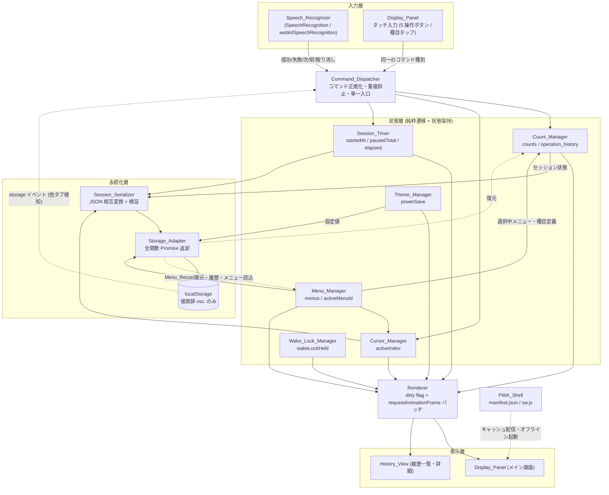

# Design Document

## Overview

本設計は、バスケットボールのシュート練習をハンズフリーで記録する PWA「Voice_Counter_App」を、**ビルド工程を一切持たない 7 個の静的ファイル**で実装するための構造を定義する。

### 設計の基本方針

1. **単一方向データフロー**: 入力（音声 / タッチ）は必ず 1 個のコマンドディスパッチャを経由し、状態マネージャ群 → レンダラ → 永続化の順に一方向で流れる。状態マネージャが DOM を直接触らず、レンダラが状態を書き換えないことで、音声由来とタッチ由来の操作が同一経路で処理される（要件 7-4）ことを構造的に保証する。
2. **永続化の完全隔離**: `localStorage` の呼び出しは Storage_Adapter の内部関数のみに存在する。公開関数はすべて Promise を返すため、将来バックエンド API へ差し替える際の変更範囲が Storage_Adapter 内部に閉じる（要件 12-1、12-2、12-3）。
3. **純粋関数コアと副作用シェルの分離**: 正規化、コマンド判定、カウント遷移、シリアライズ、集約表示の算出は引数と戻り値のみで定義される純粋関数として実装し、Web Speech API / Wake Lock API / DOM / localStorage への副作用は薄いラッパに押し出す。これによりプロパティベーステストがブラウザ API のモックなしで成立する。
4. **メニューは可変、目標合計は派生値**: 13 種目・125 本 IN は既定メニューの初期内容にすぎない。目標合計は常に選択中メニューの `targetMake` の総和として算出し、リテラル 125 をコードに埋め込まない（要件 1 前提 7、要件 17、要件 18）。
5. **第三者オリジンへの依存ゼロ**: CSS は index.html 内の `<style>` に同梱し、CDN・フォント・スクリプトの外部取得を行わない（要件 16-3、16-5）。

### 成果物ファイル（計 7 個）

| ファイル | 役割 |
|---|---|
| `index.html` | DOM 構造、インライン CSS（`<style>`）、メタ情報、`<script src="app.js">`（`type` 属性なし） |
| `app.js` | 全アプリケーションロジック（クラシックスクリプト、`import` / `export` を含まない） |
| `manifest.json` | PWA マニフェスト |
| `sw.js` | Service Worker（`import` / `export` を含まない） |
| `icon-192.png` | manifest アイコン 192×192 |
| `icon-512.png` | manifest アイコン 512×512 |
| `apple-touch-icon-180.png` | iOS 用 180×180 |

すべて index.html と同一オリジンの相対パスで参照する（要件 16-1）。テスト用ファイルは後述の「Testing Strategy」で述べるとおり配布対象外であり、この 7 個には含めない。

### app.js の内部構成

ES モジュールを使えないため、app.js 全体を 1 個の IIFE で包み、サブシステムごとにクロージャを返すファクトリ関数を定義する。グローバル汚染は行わない（テスト用の単一フック `window.__VSC_TEST__` のみを例外とし、その内容は純粋関数群の参照に限定する）。

```
(function () {
  'use strict';
  // 定数: DRILL_MENU, COMMAND_TABLE, EXCLUSION_WORDS, LIMITS, THEME
  // 純粋関数群: normalizeText, selectCommand, applyCount, undoCount,
  //             serializeSession, deserializeSession, validateMenu,
  //             deriveTargetTotal, aggregateBySection, formatElapsed, ...
  // 副作用レイヤ: createStorageAdapter, createSpeechRecognizer,
  //             createWakeLockManager, createSessionTimer,
  //             createDisplayPanel, createHistoryView, createMenuManager
  // 起動: bootstrap()
})();
```

## Architecture

### サブシステム構成と単一方向データフロー



データフローの規則:

- **実線**は通常動作時の一方向の流れ。入力 → ディスパッチャ → 状態 → レンダラ → 永続化。
- **破線**は起動時の復元と、外部イベント（他タブの `storage` イベント）による例外的な逆流。逆流は起動時と競合検知時のみに限定する。
- 状態層のマネージャは互いを直接呼ばない。種目定義の変更（Menu_Manager）がカウントやカーソルに影響する場合も、ディスパッチャが順序を決めて各マネージャを呼ぶ。
- レンダラは状態を読み取るだけで書き換えない。表示上の派生値（成功率、目標合計、セクション集約、経過時間文字列）はすべて純粋関数で都度算出し、二重に保持しない。

### コマンドディスパッチャの責務

```
dispatch(command, source, timestampMs)
  command: 'MAKE' | 'MISS' | 'NEXT' | 'PREV' | 'UNDO'
  source:  'voice' | 'touch'
```

1. 他タブ競合フラグが立っている場合は計数系コマンドを受け付けず終了（要件 12-11）。
2. `source === 'touch'` の場合、同一ボタンについて 300ms 以内の連打を破棄（要件 7-7）。音声側の 800ms 抑止は Speech_Recognizer 内で完了しているため二重適用しない。
3. 計数コマンド（MAKE / MISS）で Session_Timer が未開始なら開始（要件 11-2）。
4. 対応する状態マネージャを呼び、戻り値（適用結果 / 拒否理由）を受け取る。
4-a. 成功コマンドで当該種目の Make が targetMake に達した回（加算前 < targetMake かつ 加算後 ≥ targetMake）のみ、Cursor_Manager の `next()` を呼んで次の種目へ自動遷移する（要件 6-9）。到達の判定にはカウントと種目定義の両方が必要であり、それを同時に知るのはディスパッチャだけなので、Cursor_Manager 側は「次へ」コマンドと同じ経路を通る。最終種目では `AT_LAST` で移動しないが、これは拒否ではないためメッセージを出さない（要件 6-9-a）。
5. 拒否理由があればフィードバック領域にメッセージを積む。
6. 変更されたビュー領域に dirty フラグを立て、レンダラに再描画を要求。
7. セッション状態が変化した場合、Storage_Adapter への保存を 300ms デバウンスでスケジュール（要件 12-4）。
8. 全体成功数が目標合計に達した場合、Session_Timer に達成時間の確定を要求（要件 11-6）。

### 画面遷移

メイン画面（Display_Panel）と履歴画面（History_View）、メニュー編集画面（Menu_Manager の UI）は単一 DOM 内のパネル切り替えで実現し、ページ遷移を行わない。これにより画面遷移中も計測が継続する（要件 14-10、14-11）。

## Components and Interfaces

### Speech_Recognizer

音声認識の起動・停止・自動再開と、確定テキストからのコマンド発行を担う。

```
createSpeechRecognizer({ onCommand, onFeedback, onStatus, onFatal })
  .isSupported()            -> boolean
  .enable()                 -> void   // トグル ON
  .disable()                -> void   // トグル OFF（以後の自動再開を行わない）
  .getStatus()              -> 'recognizing' | 'restarting' | 'stopped'
```

純粋関数として切り出す部分:

```
normalizeText(raw)                          -> string          // 要件 3-9
buildExclusionMask(normalized, exclusions)  -> boolean[]       // 要件 3-10
selectCommand(normalized, table, exclusions)-> {type, word, index, length} | null  // 要件 3-6
```

### Count_Manager

```
createCountManager()
  .initFromMenu(menu)                 -> void
  .getCounts()                        -> { [drillId]: {make, attempt} }
  .apply(type, drillId)               -> {ok:true, entry} | {ok:false, reason:'CEILING'}
  .undo()                             -> {ok:true, entry} | {ok:false, reason:'EMPTY_HISTORY'}
  .resetAll(menu)                     -> void
  .purgeDrill(drillId)                -> void   // 種目削除時（要件 17-12）
  .addDrill(drillId)                  -> void   // 種目追加時（要件 17-13）
  .reconcile(menu)                    -> {dropped:number[], filled:number[]}  // 要件 1-10
  .getHistory()                       -> OperationEntry[]
  .restore(counts, history)           -> void
```

純粋関数コア:

```
applyCount(counts, history, type, drillId) -> {counts, history, rejected}
undoCount(counts, history)                 -> {counts, history, rejected}
successRate(make, attempt)                 -> number | null   // 要件 4-5, 4-6
totals(counts)                             -> {make, attempt}
```

### Cursor_Manager

```
createCursorManager()
  .setMenu(menu)                -> void
  .getIndex()                   -> number
  .getActiveDrill()             -> Drill
  .next()  -> {ok:true} | {ok:false, reason:'AT_LAST'}
  .prev()  -> {ok:true} | {ok:false, reason:'AT_FIRST'}
  .selectIndex(i)               -> {ok:boolean}
  .restore(index, n)            -> {ok:boolean, reason?:'OUT_OF_RANGE'}
  .reindexAfterMenuChange(prevIndex, prevLength, newLength, removedIndex) -> number
```

`next` / `prev` は循環しない（要件 6-5、6-6）。インデックスは常に `0 ≤ i ≤ N−1`（要件 6-7）。

Cursor_Manager はカウントを参照しないため、targetMake 到達による自動遷移（要件 6-9）の判定は行わない。判定は Command_Dispatcher が行い、同じ `next()` を呼ぶ。これにより「自動遷移」と「次へコマンド」で遷移規則が分岐しない。

### Wake_Lock_Manager

```
createWakeLockManager({ onStateChange, onMessage })
  .isSupported()   -> boolean
  .request()       -> Promise<boolean>   // 取得成功 / 取得失敗に確定（要件 9-1）
  .release()       -> Promise<void>
  .isHeld()        -> boolean
```

内部で `visibilitychange` を購読し、可視復帰かつ未取得かつセッション進行中のときに再要求する（要件 9-4）。`WakeLockSentinel` の `release` イベントでは取得状態を未取得に更新し、同一可視状態内での自動再要求を行わない（要件 9-8）。

### Theme_Manager

```
createThemeManager({ storage })
  .init()                 -> Promise<void>   // 保存値 > OS 配色 > 既定（要件 10-8,9,10）
  .isPowerSave()          -> boolean
  .toggle()               -> Promise<void>   // 500ms 以内に保存（要件 10-7）
  .getRenderBudgetMs()    -> number          // 通常 0 / 省電力 200（要件 10-4）
```

### Session_Timer

```
createSessionTimer({ now })
  .start(atMs)            -> void
  .ensureStarted(atMs)    -> void   // 要件 11-2
  .pause(atMs) / .resume(atMs)
  .freeze(atMs)           -> number // 達成時間の確定（要件 11-6, 11-7）
  .elapsedSec(atMs)       -> number // 0..86399、単調非減少
  .snapshot()             -> {startedAt, elapsedSec, frozen}
  .restore(snapshot, nowMs) -> void
```

### Display_Panel

```
createDisplayPanel({ dispatch, refs })
  .markDirty(region)      -> void   // 'active' | 'progress' | 'list' | 'timer' | 'feedback' | 'status'
  .render(state, nowMs)   -> void
  .showMessage(kind, text, holdMs) -> void
  .showConfirm(spec)      -> Promise<boolean>
```

純粋関数コア:

```
aggregateBySection(menu, counts)  -> [{section, make, targetMake}]   // 要件 8-10, 17-6
deriveTargetTotal(menu)           -> number                          // 目標合計
progressRatio(totalMake, target)  -> number                          // 0..100 上限打ち切り（要件 8-5）
formatElapsed(sec)                -> string                          // mm:ss / h:mm:ss（要件 11-3）
formatRate(make, attempt)         -> string                          // '--%' or 'xx.x%'
```

### Storage_Adapter

「Data Models」節の関数シグネチャ一覧を参照。localStorage の直接呼び出しはこのコンポーネント内部にのみ存在する。

### Session_Serializer

```
serializeSession(state)        -> string            // 要件 13-1
deserializeSession(json, menu) -> {state, issues:[]}// 要件 13-2, 13-7..13-10
serializeMenus(menus)          -> string            // 要件 13-11
deserializeMenus(json)         -> {menus, issues:[]}// 要件 13-11, 13-13, 13-14
```

キー順を固定した明示的な組み立てによって変換の決定性を確保する（要件 13-4）。

### History_View

```
createHistoryView({ storage, onBack })
  .open()                  -> Promise<void>
  .close()                 -> void
  .selectRecord(id)        -> Promise<void>
  .requestDelete(id)       -> Promise<void>
```

並び順は「終了日時の降順 → 識別子の降順」で全順序となるため、同一履歴集合に対して常に同一の並びになる（要件 14-2）。

### PWA_Shell

```
// app.js 側
registerServiceWorker() -> Promise<'registered' | 'unsupported' | 'file-scheme' | 'failed'>

// sw.js 側
CACHE_NAME = 'vsc-cache-v1'
PRECACHE   = ['./', './index.html', './app.js', './manifest.json',
              './icon-192.png', './icon-512.png', './apple-touch-icon-180.png']
install  : すべての PRECACHE 資産の格納完了時のみ install 完了（要件 15-4）
activate : CACHE_NAME 以外のキャッシュを全件削除（要件 15-6）
fetch    : ナビゲーション   → network-first（3 秒タイムアウト）→ cached index.html（要件 15-9）
           同一オリジン其他 → cache-first → network 取得時にキャッシュへ格納（要件 15-8）
           他オリジン       → 介入せずそのまま通す
```

### Menu_Manager

```
createMenuManager({ storage, serializer })
  .init()                          -> Promise<{menus, activeMenu, issues}>
  .listMenus()                     -> Menu_Record[]
  .getActiveMenu()                 -> Menu_Record
  .createMenu(name)                -> Promise<Result>
  .duplicateMenu(id, name)         -> Promise<Result>
  .renameMenu(id, name)            -> Promise<Result>
  .deleteMenu(id)                  -> Promise<Result>
  .switchMenu(id)                  -> Promise<Result>   // 進行中セッションがあれば確認必須
  .addDrill(draft)                 -> Promise<Result>
  .updateDrill(drillId, patch)     -> Promise<Result>
  .removeDrill(drillId)            -> Promise<Result>
  .reorderDrills(orderedIds)       -> Promise<Result>
  .resetActiveMenuToDefault()      -> Promise<Result>
```

`Result = {ok:true, menu} | {ok:false, violations:[{field, code, message}]}`

## Data Models

### Drill（種目）

| フィールド | 型 | 範囲・制約 |
|---|---|---|
| `id` | integer | 1 以上。当該メニュー内で一意。並べ替え・他種目削除では不変（要件 1-2、17-2） |
| `section` | string | 0〜20 文字。自由文字列。空文字を許容（要件 1-2、17-4、17-5） |
| `name` | string | 1〜40 文字（要件 1-2、17-4） |
| `targetMake` | integer | 1〜99（要件 1-2、17-4） |

### Menu_Record（メニュー 1 件）

| フィールド | 型 | 範囲・制約 |
|---|---|---|
| `id` | string | 一意。形式 `m-{base36 時刻}-{4 文字乱数}`。既定メニューは `m-default` |
| `name` | string | 1〜30 文字、メニュー間で一意（要件 18-3） |
| `drills` | Drill[] | 要素数 1〜50。配列順が表示順かつカーソル順（要件 17-4） |

Glossary の定義どおり **3 フィールドのみ**。`targetTotal` は保持せず `drills` から算出する派生値（1〜9999）である。

**種目 id の払い出し**: `nextDrillId(menu) = 1 + max(0, ...menu.drills.map(d => d.id))`。この方式は既存 id を一切触らないため、並べ替えおよび他種目の削除の前後で id が保存される（要件 17-2）。最大 id の種目を削除した直後の追加では id が再利用されうるが、種目削除時に当該 id の Make / Attempt と操作履歴要素を破棄する（要件 17-12）ため、削除済み種目のカウントが新規種目に復活することはない。

### Session_State（セッション状態・永続化される 8 フィールドのみ）

| フィールド | 型 | 範囲・制約 |
|---|---|---|
| `schemaVersion` | integer | 現行値 `1`（要件 13-3） |
| `startedAt` | string | ISO 8601 拡張形式（UTC オフセット付き）。セッション開始日時 |
| `elapsedSec` | integer | 0〜86399（要件 11-9、13-3） |
| `menuId` | string | 選択中メニュー識別子 |
| `activeIndex` | integer | 0〜N−1（要件 6-7、13-3） |
| `counts` | Array | 長さ N。要素 `{id:integer, make:integer 0..999, attempt:integer 0..999}`、`make ≤ attempt`（要件 4-3、4-4） |
| `operations` | Array | 要素数 0〜20。要素 `{drillId:integer, type:'MAKE'\|'MISS'}`。配列順が実行順（要件 5-1、5-2） |
| `ended` | boolean | セッション終了済みか否か |

これ以外のフィールドを含めない（要件 13-3）。操作履歴の「実行順序」は配列インデックスで表現し、冗長な `seq` フィールドを持たない。

**メモリ内の追加状態（永続化しない）**: `pausedTotalMs`、`pauseStartedAtMs`、`frozen`（達成時間確定済みフラグ）、`lastReportedElapsedSec`、`wakeLockHeld`、`speechEnabled`、`conflictDetected`。これらはセッション状態のスキーマを 8 フィールドに保つために意図的に永続化対象から除外し、復元時は `startedAt` と `elapsedSec` から再構成する（詳細は Session_Timer の節）。

### Operation_History_Entry（操作履歴要素）

| フィールド | 型 | 制約 |
|---|---|---|
| `drillId` | integer | 操作対象の種目 id |
| `type` | `'MAKE' \| 'MISS'` | 操作種別 |

最大 20 件。21 件目の追加時は先頭（最古）1 件を除去してから追加する（要件 5-6）。計数上限で拒否された操作は追加しない（要件 4-13）。

### History_Record（履歴レコード）

| フィールド | 型 | 制約 |
|---|---|---|
| `schemaVersion` | integer | `1` |
| `id` | string | 全履歴で一意。`h-{base36 時刻}-{4 文字乱数}` |
| `endedAt` | string | ISO 8601 拡張 `YYYY-MM-DDThh:mm:ss±hh:mm`（要件 14-1） |
| `completionSec` | integer | 0〜86399 |
| `menuId` | string | セッションのメニュー識別子 |
| `menuName` | string | セッション時点のメニュー名 |
| `targetTotal` | integer | セッション時点の目標合計 1〜9999 |
| `totalMake` | integer | 0〜N×999 |
| `totalAttempt` | integer | 1 以上（0 の場合は保存しない：要件 14-9） |
| `totalRate` | number | 0.0〜100.0（小数第 1 位） |
| `achieved` | boolean | `totalMake >= targetTotal` |
| `drills` | Array | 要素 `{name, targetMake, make, attempt, rate}`。セッション時点のスナップショット（要件 14-1） |

最大 100 件。101 件目は「終了日時が最古 → 同時刻なら識別子最小」の 1 件を削除してから保存（要件 14-6）。

### Settings（設定）

| フィールド | 型 | 制約 |
|---|---|---|
| `schemaVersion` | integer | `1` |
| `powerSave` | `boolean \| null` | `null` は未設定（OS 配色にフォールバック：要件 10-9、10-10） |

選択中メニュー識別子は独立した関数で読み書きするため（要件 12-1）、設定とは別キーに保持する。

### localStorage キーレイアウト

共通接頭辞は `vsc:` の 1 個のみ。この接頭辞を持たない鍵は読まず、変更せず、削除しない（要件 12-3）。

| 鍵 | 内容 |
|---|---|
| `vsc:session` | 進行中セッションの JSON（Session_Serializer の出力） |
| `vsc:menus` | Menu_Record[] の JSON |
| `vsc:activeMenuId` | 選択中メニュー識別子（JSON 文字列） |
| `vsc:settings` | Settings の JSON |
| `vsc:hist:index` | `[{id, endedAt}]` の JSON（並び順決定と最古判定に使用） |
| `vsc:hist:{id}` | History_Record 1 件の JSON |
| `vsc:probe` | 書き込み可否検証用の一時鍵（検証後に必ず削除） |

履歴を 1 件 1 鍵とする理由: 容量超過時の「最古 1 件削除 → 再試行」の繰り返し（要件 12-6）が、他 99 件の再書き込みを伴わずに実行できるため。インデックス鍵のみ書き換えれば済む。

### schemaVersion の扱い

| 保存データの状態 | 動作 |
|---|---|
| `schemaVersion` 欠落 / 非整数 / 現行値より大きい | いずれのフィールドも復元せず初期状態を返し、メッセージ表示、保存データは変更しない（要件 13-8） |
| `schemaVersion` < 現行値 | 存在するフィールドの値を保持し、欠落フィールドを既定値で補完、`schemaVersion` を現行値に設定（要件 13-9） |
| `schemaVersion` == 現行値 | 値域検証（要件 13-10）を実施し、違反があれば初期状態を返す |

現行スキーマバージョンは `1`。将来の版上げでは「< 現行値」の分岐に版ごとのマイグレーション関数を追加する設計とし、`SCHEMA_MIGRATIONS = {1: fn, 2: fn}` のテーブル駆動とする。

### Storage_Adapter の関数シグネチャ一覧

公開関数は 13 個。**すべて Promise を返し、同期例外を送出せず、1000ms 以内に解決または拒否する**（要件 12-2）。

```
// --- 進行中セッション ---
saveSession(sessionState)      -> Promise<void>
loadSession()                  -> Promise<SessionState | null>
deleteSession()                -> Promise<void>

// --- 履歴 ---
appendHistory(historyRecord)   -> Promise<HistoryRecord>   // 100 件超過時は最古を削除して保存
listHistory()                  -> Promise<HistoryRecord[]> // 終了日時降順 → id 降順
deleteHistory(id)              -> Promise<void>

// --- 設定 ---
saveSettings(settings)         -> Promise<void>
loadSettings()                 -> Promise<Settings>        // 未保存時は {schemaVersion:1, powerSave:null}

// --- メニュー ---
listMenus()                    -> Promise<Menu_Record[]>
saveMenu(menuRecord)           -> Promise<Menu_Record>     // 作成・更新の upsert
deleteMenu(id)                 -> Promise<void>

// --- 選択中メニュー識別子 ---
saveActiveMenuId(id)           -> Promise<void>
loadActiveMenuId()             -> Promise<string | null>
```

拒否値は必ず次の形の値（`Error` ではなく素のオブジェクト）で、呼び出し側が分岐できるようにする。

```
{ code: 'QUOTA_EXCEEDED' | 'UNAVAILABLE' | 'VERIFY_MISMATCH'
       | 'NOT_FOUND' | 'INVALID' | 'TIMEOUT',
  key: string,
  message: string }
```

実装の共通ラッパ:

```
function guarded(key, fn) {
  return new Promise(function (resolve, reject) {
    var settled = false;
    var timer = setTimeout(function () {
      if (!settled) { settled = true; reject({code:'TIMEOUT', key:key, message:'保存処理が時間内に完了しませんでした'}); }
    }, 1000);                       // 要件 12-2 の 1000ms 保証
    try {
      var value = fn();             // 同期的な localStorage 操作
      if (!settled) { settled = true; clearTimeout(timer); resolve(value); }
    } catch (e) {
      if (!settled) { settled = true; clearTimeout(timer); reject(toReason(e, key)); }
    }
  });
}
```

**バックエンドへの差し替え手順**: 上記 13 関数の本体を `fetch` 呼び出しに置換するだけで済む。`guarded` のタイムアウトとデバウンスはそのまま流用でき、拒否値の `code` 集合（`QUOTA_EXCEEDED` は `INSUFFICIENT_STORAGE`、`UNAVAILABLE` はネットワーク障害に対応）も維持される。呼び出し側は既に「非同期・失敗しうる」前提で書かれているため、Count_Manager / Menu_Manager / Theme_Manager / History_View には変更が生じない。差し替え時に唯一追加検討が必要なのは、他タブ競合検知を `storage` イベントから楽観ロック（`If-Match` / バージョン番号）へ置き換える点であり、これも Storage_Adapter の内部と競合通知コールバックの実装に閉じる。

## Correctness Properties

*A property is a characteristic or behavior that should hold true across all valid executions of a system-essentially, a formal statement about what the system should do. Properties serve as the bridge between human-readable specifications and machine-verifiable correctness guarantees.*

本節のプロパティは、app.js から `window.__VSC_TEST__` として公開される純粋関数群に対して直接検証する。各プロパティは 1 個のプロパティベーステストとして実装し、最低 100 回の反復で実行する。

各プロパティは「対象関数」「生成する入力」「検証する主張」の 3 点で定義する。生成する入力は Testing Strategy で述べる自作ハーネス `pbt.js` の生成器で構成し、失敗時は同ハーネスの縮小器が最小反例を報告する。

### Property 1: Undo ラウンドトリップ

*For any* カウント状態 S と任意の計数操作 op について、S に op を適用した直後に 1 回の取り消しを適用した結果は S と一致する。op が計数上限により拒否された場合は適用結果自体が S と一致し、取り消しは適用前の履歴末尾のみを対象とする。

| 項目 | 内容 |
|---|---|
| 対象関数 | `applyCount(counts, history, type, drillId)` / `undoCount(counts, history)` |
| 生成する入力 | 種目数 N（1〜50）のカウント状態（各種目 `0 ≤ make ≤ attempt ≤ 999`、`attempt` を 0〜999 の一様分布と 995〜999 に寄せた分布の混合で生成）、長さ 0〜20 の操作履歴、操作種別 `MAKE` / `MISS`、対象種目 id（存在する id を主に、存在しない id を低頻度で混入） |
| 検証する主張 | `r = applyCount(S)` が `ok` のとき `undoCount(r).counts` と `r.history` が S の `counts` / `history` に深い等価で一致する。`r.rejected === 'CEILING'` のとき `r.counts` / `r.history` が S と一致する。いずれの場合も他種目の `make` / `attempt` が変化しない |

**Validates: Requirements 5.10, 5.3, 4.13**

### Property 2: 連続 Undo による初期状態への完全復帰

*For any* 初期カウント状態 S₀ と長さ k（0 ≤ k ≤ 20）の計数操作列について、k 個の操作を順に適用した後に k 回の取り消しを適用した結果は S₀ と一致し、操作履歴は 0 件になる。

| 項目 | 内容 |
|---|---|
| 対象関数 | `applyCount` / `undoCount` の反復適用 |
| 生成する入力 | 操作履歴 0 件の初期カウント状態 S₀、長さ 0〜20 の操作列（種別と対象種目 id をそれぞれ独立に生成。対象種目はアクティブ種目に限定せず全種目から選ぶ） |
| 検証する主張 | k 回の適用後に k 回の取り消しを行うと `counts` が S₀ の `counts` と一致し、`history.length === 0`。k+1 回目の取り消しは `{ok:false, reason:'EMPTY_HISTORY'}` を返し状態を変えない。上限拒否を含む列では拒否操作が履歴に積まれないため、取り消し回数は「受理された操作数」で数える |

**Validates: Requirements 5.4, 5.5, 5.6**

### Property 3: カウントの不変条件

*For any* 初期カウント状態と任意の長さの操作列（成功・失敗・取り消しの混在）について、操作列の全ステップ実行後の各時点で、選択中メニューの全種目が `0 ≤ Make ≤ Attempt ≤ 999` を満たす。

| 項目 | 内容 |
|---|---|
| 対象関数 | `applyCount` / `undoCount` / `deserializeSession` の各直後の状態 |
| 生成する入力 | 初期カウント状態（境界に寄せた分布を含む）、長さ 0〜200 の操作列（`MAKE` / `MISS` / `UNDO` を混在させ、同一種目への連続加算が上限に達する列を生成器で意図的に作る） |
| 検証する主張 | 各ステップ直後に全種目で `Number.isInteger(make) && Number.isInteger(attempt) && 0 ≤ make ≤ attempt ≤ 999`。加えて復元経路（任意文字列を `deserializeSession` した結果）についても同一の不変条件が成立する |

**Validates: Requirements 4.3, 4.4**

### Property 4: セッション直列化の決定性

*For any* 有効なセッション状態 S について、S を 2 回変換して得た 2 個の JSON 文字列は文字単位で一致する。さらに、フィールドの挿入順のみが異なる等価なオブジェクトから得た JSON 文字列も同一である。

| 項目 | 内容 |
|---|---|
| 対象関数 | `serializeSession(state)` |
| 生成する入力 | 有効な Session_State（8 フィールドすべてを値域内で生成）と、同一内容でキー挿入順をランダムに入れ替えたコピー |
| 検証する主張 | `serializeSession(S) === serializeSession(S)` かつ `serializeSession(S) === serializeSession(shuffleKeys(S))`。`counts` 配列と `operations` 配列の要素順は入力順どおりに保たれる（要素順は意味を持つため入れ替えの対象としない） |

**Validates: Requirements 13.4**

### Property 5: セッション直列化のラウンドトリップ

*For any* 有効なセッション状態 S と S に整合する選択中メニューについて、S を変換して得た JSON 文字列を復元した状態の 8 フィールドすべての値は S の対応する値と一致する。

| 項目 | 内容 |
|---|---|
| 対象関数 | `serializeSession` → `deserializeSession(json, menu)` |
| 生成する入力 | メニューと Session_State の組を同時生成（`counts` の要素数と種目 id 集合をメニューに一致させ、`activeIndex` を 0〜N−1、`elapsedSec` を 0〜86399、`operations` を 0〜20 件で生成） |
| 検証する主張 | 復元結果の `schemaVersion` / `startedAt` / `elapsedSec` / `menuId` / `activeIndex` / `counts`（要素順と 3 属性）/ `operations`（要素順と 2 属性）/ `ended` が S と深い等価で一致し、`issues` が 0 件 |

**Validates: Requirements 13.5, 13.3**

### Property 6: 復元の冪等性

*For any* 文字列 J（有効・無効を問わない）について、J を復元した状態を変換して再度復元した状態の全フィールドの値は、J を 1 回復元した状態の全フィールドの値と一致する。

| 項目 | 内容 |
|---|---|
| 対象関数 | `deserializeSession` と `serializeSession` の合成 |
| 生成する入力 | 有効 JSON / フィールド欠落 JSON / 値域違反 JSON / JSON でない文字列 / 配列や数値リテラル / 空文字列 / ランダムな Unicode 文字列 を混合分布で生成（有効入力に偏らないよう各カテゴリを最低 1 割ずつ割り当てる） |
| 検証する主張 | `d1 = deserializeSession(J, menu).state`、`d2 = deserializeSession(serializeSession(d1), menu).state` としたとき `d1` と `d2` が深い等価で一致する |

**Validates: Requirements 13.6**

### Property 7: 不正入力に対する復元の全域性

*For any* 文字列 J と任意の有効メニューについて、`deserializeSession` は例外を送出せず、常に選択中メニューに整合する妥当なセッション状態を返す。J が解析不能・スキーマ解釈不能・値域違反のいずれかに該当する場合、返る状態は初期状態と一致し、`issues` が 1 件以上含まれる。

| 項目 | 内容 |
|---|---|
| 対象関数 | `deserializeSession(json, menu)` |
| 生成する入力 | Property 6 と同一の混合分布に加え、`schemaVersion` を 欠落 / 非整数 / 0 / 現行値 / 現行値より大きい値 に振り分けた JSON、および 種目要素数不一致・`make > attempt`・`attempt = 1000`・`activeIndex = N`・`elapsedSec = 86400`・`operations` 21 件 の各違反を 1 個ずつ注入した JSON |
| 検証する主張 | 呼び出しが例外を送出しない。返る `state` は常に `counts.length === N`、種目 id 集合がメニューと一致、全種目で `0 ≤ make ≤ attempt ≤ 999`、`0 ≤ activeIndex ≤ N−1`、`0 ≤ elapsedSec ≤ 86399`、`operations.length ≤ 20` を満たす。解析不能・`schemaVersion` 過大または欠落・値域違反のいずれかの入力では `state` が初期状態（全 Make / Attempt 0、`activeIndex` 0、`elapsedSec` 0、`operations` 0 件、`ended` false）と一致し `issues.length ≥ 1`。`schemaVersion` が現行値より小さい入力では、存在するフィールドの値が保持され欠落フィールドのみが既定値で補完される |

**Validates: Requirements 13.7, 13.8, 13.9, 13.10**

### Property 8: Menu_Record のラウンドトリップ

*For any* 有効な Menu_Record の集合 M について、M を変換して得た JSON 文字列を復元した結果の全メニューの識別子、メニュー名、種目配列の要素順、および各種目の id / section / name / targetMake は M の対応する値と一致する。

| 項目 | 内容 |
|---|---|
| 対象関数 | `serializeMenus(menus)` → `deserializeMenus(json)` |
| 生成する入力 | メニュー 1〜20 件（名称は 1〜30 文字で集合内一意、種目は 1〜50 件で id がメニュー内一意、`section` は 0〜20 文字の自由文字列（空文字と絵文字を含む）、`name` は 1〜40 文字、`targetMake` は 1〜99 かつ総和 ≤ 9999） |
| 検証する主張 | 復元結果の `menus` が M と配列順を含めて深い等価で一致し、`issues` が 0 件。決定性として `serializeMenus(M) === serializeMenus(M)` も同時に確認する |

**Validates: Requirements 13.11, 13.12**

### Property 9: メニュー検証条件の網羅と不正メニューの除外

*For any* 有効な Menu_Record 集合と、第 13-13 項の検証条件のうちランダムに選んだ 1 個に対する違反の注入について、復元結果は違反メニューを含まず、違反のない他のメニューをすべて保持し、結果の件数は常に 1 以上である。

| 項目 | 内容 |
|---|---|
| 対象関数 | `deserializeMenus(json)` / `validateMenu(menu, allMenus)` |
| 生成する入力 | 有効な集合に対し次の違反を 1 種類だけ注入: メニュー数 21 以上 / メニュー名 0 文字 / メニュー名 31 文字以上 / メニュー名の重複 / 種目数 0 / 種目数 51 以上 / 種目 id の重複 / `targetMake` が 0・100・非整数 / 目標合計 10000 以上。注入対象メニューの位置（先頭・中間・末尾）も生成対象とする |
| 検証する主張 | 違反を注入したメニューの識別子が結果に含まれない。違反のないメニューは識別子・名称・種目配列が保持される。除外後に 0 件となる場合は既定メニュー 1 件のみ（名称「朝練125本IN」、13 種目、目標合計 125）が返る。`issues.length ≥ 1`。`validateMenu` の違反コード集合が注入した違反の種類と対応する |

**Validates: Requirements 13.13, 13.14, 18.3, 18.6**

### Property 10: カーソルの境界維持と非循環

*For any* 種目数 N（1 ≤ N ≤ 50）と任意の移動コマンド列について、アクティブ種目インデックスは常に 0 以上 N−1 以下に留まり、末尾および先頭で循環せず、全ステップで全種目の Make と Attempt が変化しない。

| 項目 | 内容 |
|---|---|
| 対象関数 | `cursorReducer(index, N, command)`（`next` / `prev` / `selectIndex` の純粋版） |
| 生成する入力 | N（1〜50、N=1 を高頻度で含む）、初期インデックス（0〜N−1）、長さ 0〜200 のコマンド列（`NEXT` / `PREV` / `SELECT(i)` を混在。`SELECT` の引数には範囲外の値も低頻度で混入）、および移動と無関係なカウント状態 |
| 検証する主張 | 全ステップ後に `Number.isInteger(i) && 0 ≤ i ≤ N−1`。`i === N−1` での `NEXT` は `i` を変えず `reason === 'AT_LAST'` を返す。`i === 0` での `PREV` は `i` を変えず `reason === 'AT_FIRST'` を返す。N=1 では `NEXT` / `PREV` のいずれも `i === 0` を維持する。範囲外の `SELECT` は `i` を変えない。コマンド列の全ステップでカウント状態が深い等価で不変 |

**Validates: Requirements 6.5, 6.6, 6.7, 6.1**

### Property 11: 種目 id の安定性

*For any* メニューとカウント状態、および任意の長さの「並べ替え」「削除」操作列について、操作列の後に残存する種目の id と、当該 id に対応する Make / Attempt は操作前の値と一致する。

| 項目 | 内容 |
|---|---|
| 対象関数 | `reorderDrills(menu, orderedIds)` / `removeDrill(menu, drillId)` と `Count_Manager.purgeDrill` / `addDrill` の純粋版 |
| 生成する入力 | 種目 1〜50 件のメニュー、各種目に対応するカウント（0 ≤ make ≤ attempt ≤ 999）、長さ 0〜30 の操作列（`REORDER`（ランダム置換）と `REMOVE`（残数が 1 になる手前まで）を混在）。追加を含む変種では末尾に `ADD` を混ぜる |
| 検証する主張 | 操作列の後に残る種目集合の各 id について、id 値そのものと `counts[id].make` / `counts[id].attempt` が初期値と一致する。削除された id のカウントと当該 id を対象とする操作履歴要素は結果に存在しない。`ADD` で追加された種目の id は既存 id と重複せず、その Make / Attempt は 0 である |

**Validates: Requirements 17.2, 17.3, 17.12, 17.13**

### Property 12: 経過時間の単調非減少と上限飽和

*For any* 開始時刻と任意の現在時刻の列（過去方向への後退および大幅な前進を含む）について、算出される経過時間の列は単調非減少であり、常に 0 以上 86399 以下で、86399 に達した後は増加しない。

| 項目 | 内容 |
|---|---|
| 対象関数 | `elapsedFrom(startedAtMs, pausedTotalMs, lastReportedSec, nowMs)`（現在時刻を引数で受け取る純粋関数） |
| 生成する入力 | 開始時刻、長さ 1〜200 の現在時刻列（増分に 正の値・0・負の値（時計の後退）・86400 秒を超える巨大ジャンプ を混在させる）、および一時停止累計時間の列 |
| 検証する主張 | 出力列 `e[0..m]` が全 i について `e[i] ≤ e[i+1]`。全要素が整数かつ `0 ≤ e[i] ≤ 86399`。ある i で `e[i] === 86399` なら以降すべて `86399`。時刻が後退した入力でも直前値を下回らない。`formatElapsed` は 3600 未満で `mm:ss`、3600 以上で `h:mm:ss` の形式に一致する |

**Validates: Requirements 11.9, 11.3, 11.8**

### Property 13: コマンド選択の決定性と優先順規則

*For any* 認識テキストについて、コマンド選択は常に同一の結果（0 個または 1 個のコマンド）を返し、その選択は「除外語範囲のマスキング後に残った出現のうち、開始位置が最小 → 文字数が最大 → 既定優先順（成功 → 失敗 → 次種目 → 前種目 → 取り消し）」の順で一意に決定される。

| 項目 | 内容 |
|---|---|
| 対象関数 | `buildExclusionMask(normalized, exclusions)` / `selectCommand(normalized, table, exclusions)` |
| 生成する入力 | コマンド語（5 種別の全語）と除外語（「ライン」「インサイド」「インステップ」「サイン」「アウトサイド」「前半」「手前」を含む）と雑音文字を任意個・任意順で連結したテキスト。開始位置が同一になる語の組（「イン」と「入った」など）と、長さが同一で種別が異なる組を意図的に生成する分岐を含める |
| 検証する主張 | `selectCommand(t)` を 2 回呼んだ結果が一致する（決定性）。結果は `null` または単一のコマンドで、複数を同時に返さない。素朴な参照実装（全コマンド語の全出現を列挙し `(index 昇順, length 降順, 種別優先順)` で安定ソートして先頭を採る）の結果と一致する（モデルベース検証）。マスク範囲に完全に含まれる出現は選択されない。除外語のみからなるテキストでは `null` を返す |

**Validates: Requirements 3.1, 3.2, 3.3, 3.4, 3.5, 3.6, 3.8, 3.10**

### Property 14: 正規化の冪等性

*For any* 文字列 t について `normalizeText(normalizeText(t)) === normalizeText(t)` が成立し、結果は長さ 200 以下で、除去対象の空白文字および区切り記号を含まない。

| 項目 | 内容 |
|---|---|
| 対象関数 | `normalizeText(raw)` |
| 生成する入力 | 任意 Unicode 文字列（半角カタカナ、濁点・半濁点付き半角カナ、全角英数字、大文字英字、全角カタカナ、ひらがな、半角空白・全角空白・タブ・改行、区切り記号「、。，．・!?！？」、200 文字を超える長文、サロゲートペア、空文字 を混合分布で生成） |
| 検証する主張 | 冪等性が成立する。`result.length ≤ 200`。結果に空白文字・区切り記号・半角カタカナ・全角英数字・大文字英字・カタカナが含まれない。コマンド語表の各語に同じ正規化を適用した値もまた冪等である |

**Validates: Requirements 3.9**

### Property 15: 目標合計の整合性と進捗充填率の値域

*For any* メニューと任意のカウント状態について、目標合計は選択中メニューの全種目の `targetMake` の総和と一致し、全体進捗バーの充填率は 0 以上 100 以下に収まる。

| 項目 | 内容 |
|---|---|
| 対象関数 | `deriveTargetTotal(menu)` / `progressRatio(totalMake, target)` / `aggregateBySection(menu, counts)` / `totals(counts)` |
| 生成する入力 | 種目 1〜50 件のメニュー（`targetMake` 1〜99、総和 ≤ 9999、`section` に重複と空文字を含む）、カウント状態（全体成功数が目標合計を下回る場合・一致する場合・大きく超える場合を含む） |
| 検証する主張 | `deriveTargetTotal(menu) === menu.drills.reduce((a,d) => a + d.targetMake, 0)` かつ `1 ≤ deriveTargetTotal ≤ 9999`。`0 ≤ progressRatio ≤ 100` で、全体成功数が目標合計以上のとき厳密に `100`。`aggregateBySection` の行数が `section` の異なる値の個数と一致し、全行の `make` 合計が `totals(counts).make` に、全行の `targetMake` 合計が目標合計に一致する（集約による保存則）。リテラル 125 が算出経路に現れない（前提 7: 目標値のハードコード禁止） |

**Validates: Requirements 8.4, 8.5, 8.10, 4.7, 4.8, 17.6**

### Property 16: 成功率の値域と丸めおよび未試投表示

*For any* `0 ≤ make ≤ attempt ≤ 999` について、成功率は 0.0 以上 100.0 以下の小数第 1 位までの値であり、`attempt` が 0 のときの表示値は「--%」である。

| 項目 | 内容 |
|---|---|
| 対象関数 | `successRate(make, attempt)` / `formatRate(make, attempt)` |
| 生成する入力 | `attempt` を 0〜999、`make` を 0〜`attempt` で生成（`attempt = 0`、`make = attempt`、`make = 0` の各境界を高頻度で含む） |
| 検証する主張 | `attempt === 0` のとき `successRate` が `null` を返し `formatRate` が `'--%'` に一致する。それ以外では `0.0 ≤ successRate ≤ 100.0` かつ小数部が 1 桁以内で、`Math.round(make / attempt * 1000) / 10` と一致する。`make === attempt` のとき `100.0`、`make === 0` のとき `0.0`。`formatRate` は `/^\d{1,3}\.\d%$/` に一致する |

**Validates: Requirements 4.5, 4.6, 14.4**

### Property 17: 履歴並び順の全順序性

*For any* 履歴レコード集合と任意の入力順について、並び替えの結果は入力順に依存せず一意に定まる。

| 項目 | 内容 |
|---|---|
| 対象関数 | `sortHistoryIndex(entries)` |
| 生成する入力 | 0〜100 件の `{id, endedAt}`（`endedAt` の重複を意図的に高頻度で含め、`id` は一意）と、その入力順のランダム置換 |
| 検証する主張 | 任意の置換に対してソート結果の `id` 列が一致する。結果は `endedAt` 降順、同値では `id` 降順に並ぶ。最古判定（`endedAt` 最小、同値では `id` 最小）が結果の末尾要素と一致する |

**Validates: Requirements 14.2, 14.6, 12.6**

## Error Handling

### 共通規則

1. **提示先の一本化**: 利用者向けメッセージはすべて Display_Panel のフィードバック領域（または確認ダイアログ）に集約し、`showMessage(kind, text, holdMs)` の 1 経路のみを使う。`kind` は `info` / `warn` / `error` の 3 種で、省電力モードでも要件 10-6 のコントラスト比 7:1 を満たす無彩色系の配色を用いる。
2. **重複抑止**: 各失敗は `reasonKey`（原因種別 + 対象鍵）を持ち、同一 `reasonKey` のメッセージは一度提示したら同一セッション中は再提示しない（要件 12-7）。抑止中も内部カウンタのみ加算する。
3. **状態の不変性の既定**: 「内部状態の扱い」欄に明示がない限り、失敗時は全種目の Make / Attempt、アクティブ種目、操作履歴、経過時間を変化前の値のまま維持する。失敗が状態を部分的に書き換えることはない。
4. **計測機能の生存性**: 永続化・音声認識・Wake Lock・Service Worker のいずれが失敗しても、カウント、カーソル移動、取り消し、タッチ操作は操作可能な状態を維持する（要件 9-5、12-7、15-10、16-6）。
5. **例外の境界**: 純粋関数は例外を送出しない設計とし（Property 7）、ブラウザ API 呼び出しはすべて `try` / `catch` または `Promise` の拒否で捕捉して上記の `reasonKey` 付き失敗値に正規化する。

### 分岐別の扱い

| 事象（要件） | 検知方法 | 利用者への提示 | 内部状態の扱い | 再試行方針 |
|---|---|---|---|---|
| Web Speech API 非対応（2-7） | 起動時に `window.SpeechRecognition` と `window.webkitSpeechRecognition` の両方が `undefined` | 音声認識が使えず手動ボタンで計測できることを `info` で常時表示 | 音声認識トグルを `disabled` にし `speechEnabled` を false で固定 | 再試行しない（環境依存の恒久的条件） |
| マイク許可拒否（2-8） | `onerror` の `error === 'not-allowed'` または `'service-not-allowed'` | マイク許可が必要であることを `warn` で表示 | トグルを無効状態に戻し、自動再開カウンタを 0 に初期化 | 自動再開を行わない。利用者が再度トグルを有効化した時のみ再要求 |
| 空結果 5 回連続（2-11） | 結果を 1 件も受信せずに `onend` が発火した回数の連続カウンタが 5 に到達 | 音声認識を継続できないことと手動ボタンで計測できることを `warn` で表示 | トグルを無効状態に戻し、Make / Attempt は現在値を維持 | 自動再開を中止。利用者の再有効化で連続カウンタを 0 に戻して再開 |
| オフラインでの音声認識失敗（15-7） | `onerror` の `error === 'network'`、または `navigator.onLine === false` かつ結果を得ずに終了 | 検知から 1 秒以内に音声認識が利用できないことを `warn` で表示 | トグルを無効状態に戻し、手動タッチ操作で計測を継続 | オンライン復帰（`online` イベント）までは自動再開しない。復帰後は利用者の再有効化を待つ |
| Wake Lock 非対応（9-5） | `'wakeLock' in navigator` が false | スリープ防止が使えず端末の自動ロックで消灯しうることを `info` で表示 | `wakeLockHeld` を false で固定。代替手段（無音動画再生等）を使用しない | 要求を一度も発行しない |
| Wake Lock 要求失敗（9-6） | `navigator.wakeLock.request('screen')` の拒否 | 1 秒以内にスリープ防止を有効化できなかったことを `warn` で表示 | 取得状態を未取得として確定 | 同一の可視状態の間は自動再要求しない。`visibilitychange` による可視復帰で初めて再要求（9-4） |
| 意図しない Wake Lock 解放（9-8） | `WakeLockSentinel` の `release` イベントが利用者操作・セッション終了以外で発火 | インジケーター表示を 1 秒以内に終了（追加メッセージは出さない） | 取得状態を未取得に更新 | ページが可視である間は自動再要求しない。次の可視復帰時に再要求 |
| 計数上限 999（4-13） | `applyCount` が `{ok:false, reason:'CEILING'}` を返す | 当該種目が計数上限に達したことを `warn` で表示 | 全種目の Make / Attempt を維持し、当該操作を操作履歴に追加しない | 再試行しない。取り消しまたは全カウント初期化で解消 |
| 操作履歴 0 件での取り消し（5-5） | `undoCount` が `{ok:false, reason:'EMPTY_HISTORY'}` を返す | 500ms 以内に取り消し対象が存在しないことを `info` で表示 | Make / Attempt / アクティブ種目を維持 | 再試行しない。取り消しボタンは常に操作可能なまま維持（5-11） |
| カーソル両端（6-5, 6-6） | `cursorReducer` が `AT_LAST` / `AT_FIRST` を返す | 500ms 以内に最後 / 最初の種目であることを `info` で表示し 3 秒間継続 | 当該端の種目をアクティブとして維持し、循環しない。Make / Attempt は不変 | 再試行しない |
| 保存済みインデックス不正（6-11） | 復元値が整数でない、または 0〜N−1 の範囲外 | アクティブ種目を復元できなかったことを `warn` で表示 | インデックスを 0 に設定。全種目の Make / Attempt は保存済みの値を維持 | 復元後の正規化済み状態を通常のデバウンス保存で上書き |
| メニュー id 不整合（1-10） | 復元した `counts` の id 集合と選択中メニューの id 集合の差分が非空 | 一部のカウントを引き継げなかったことを `warn` で表示 | メニューの id 集合を正とし、余剰 id のカウントを破棄、欠落 id を Make / Attempt 0 で補完、該当 id の操作履歴要素を除去 | 正規化後の状態を保存して不整合を解消 |
| 容量超過と履歴退避（12-6） | `setItem` が `QuotaExceededError` / `NS_ERROR_DOM_QUOTA_REACHED` を送出し、履歴が 1 件以上 | 退避が成功した場合はメッセージを出さない（無音で回復） | 最古 1 件（`endedAt` 最小 → id 最小）を削除して `vsc:hist:index` を更新 | 保存成功または履歴 0 件になるまで最大 100 回、削除と再試行を繰り返す |
| 履歴 0 件での容量超過（12-9） | 上記の退避ループが履歴 0 件に到達しても失敗 | 保存できないことを `error` で表示（`reasonKey` により 1 回のみ） | 保存対象の鍵の内容を試行前のまま維持。メモリ内状態で操作を継続 | 当該関数の Promise を `{code:'QUOTA_EXCEEDED'}` で拒否。自動再試行しない |
| localStorage 利用不可・書き込み検証失敗（12-7） | 起動時の `vsc:probe` への書き込み→読込→削除が失敗、または通常保存の直後の読込値が書き込んだ値と不一致 | 保存できないことを `error` で表示。同一原因では重複表示しない | メモリ内状態でカウント・カーソル移動・取り消しを継続。以後の保存呼び出しは即時拒否に短絡 | `{code:'UNAVAILABLE'}` / `{code:'VERIFY_MISMATCH'}` で拒否。同一原因では以後の自動再試行を行わない |
| 保存処理のタイムアウト（12-2） | `guarded` の 1000ms タイマーが先に発火 | 保存の遅延を `warn` で表示 | メモリ内状態を正として維持 | `{code:'TIMEOUT'}` で拒否。次回の状態変化時のデバウンス保存で自然に再試行 |
| 他タブ競合（12-11） | `storage` イベントで `key === 'vsc:session'` かつ自タブ由来でない変化を検知 | 他のタブで練習が進行していることを `error` で表示し、再読込を促す | `conflictDetected` を立て、進行中セッションの上書き保存を停止し、計数コマンドの受付を停止 | 利用者の再読込操作まで再試行しない。再読込で保存データを正として復元 |
| 保存データ解析不能（13-7） | `JSON.parse` が例外、または結果がオブジェクトでない | 保存データを復元できなかったことを `warn` で表示 | 初期状態を採用。当該保存データは変更しない | 新しいセッションの最初の状態変化時に上書き保存 |
| schemaVersion 欠落・非整数・過大（13-8） | `schemaVersion` が存在しない / 非整数 / 現行値（1）より大きい | 保存データを解釈できなかったことを `warn` で表示 | いずれのフィールドも復元せず初期状態を採用。保存データは変更しない | 自動再試行しない（将来版のデータを壊さないため上書きも即時には行わない） |
| 意味的不正（13-10） | 種目要素数不一致 / Make・Attempt の値域違反 / `make > attempt` / `activeIndex` 範囲外 / `elapsedSec` 範囲外 / 操作履歴 21 件以上 | 保存データの値が制約を満たさず復元できなかったことを `warn` で表示 | 初期状態を採用。保存データは変更しない | 新しいセッションの状態変化時に上書き保存 |
| Menu_Record 不正（13-14） | `validateMenu` が 1 個以上の違反コードを返す | メニュー定義を復元できなかったことを `warn` で表示 | 違反メニューを除外した集合を採用。0 件になる場合は既定メニュー 1 件を生成 | 除外後の集合を直ちに保存し直して不整合を解消 |
| 選択中メニュー識別子の不一致（18-14） | `vsc:activeMenuId` がいずれの Menu_Record の id とも一致しない | 前回使用したメニューを復元できなかったことを `warn` で表示 | 既定メニューが存在すればそれを、なければ残存メニューの 1 個を選択中に設定 | 決定した識別子を直ちに保存 |
| 試投 0 でのセッション終了（14-9） | 終了処理時点の `totals(counts).attempt === 0` | 記録対象の計測がなかったことを `info` で表示 | 履歴レコードを保存せず、保存済み履歴の件数を終了前の値に維持 | 再試行しない。進行中セッションの保存データのみ削除 |
| 最後のメニュー削除拒否（18-7） | 削除要求時点の保存済みメニュー数が 1 | メニューを 1 個以上保持する必要があることを `warn` で表示 | メニュー集合と選択中メニューを操作前の値に維持 | 再試行しない |
| メニュー編集の入力検証（17-7） | `validateMenu` が `violations` を返す（name 0 文字 / 41 文字以上、`section` 21 文字以上、`targetMake` が 1〜99 の整数でない、種目数 0 または 51 以上、目標合計 9999 超） | 制約を満たさない項目を項目単位で `warn` で表示 | 編集内容を保存せず、当該メニューの内容を編集前の値に維持 | 利用者が入力を修正して再送するまで再試行しない |
| メニュー名・件数の制約違反（18-4） | メニュー数 20 超 / 名称が 1〜30 文字の範囲外 / 既存名称と一致 | 制約を満たさない項目を `warn` で表示 | メニュー集合と選択中メニューを操作前の値に維持 | 利用者の再入力を待つ |
| メニュー保存の失敗（17-18） | `saveMenu` の Promise が拒否 | メニュー内容を保存できないことを `error` で表示 | メモリ内のメニュー内容を正として保持し、カウント・カーソル移動・取り消しを継続 | 次回のメニュー編集完了時に再試行 |
| Service Worker 非対応 / file:// / 登録失敗（15-10, 16-6） | `'serviceWorker' in navigator` が false、`location.protocol === 'file:'`、または `register` の拒否 | オフライン利用の準備ができていないこと（file:// の場合はインストールとオフラインキャッシュが利用できないこと）を `info` で表示 | Service Worker を使わずに動作継続。計測機能を操作可能な状態に維持 | 再試行しない。`registerServiceWorker` は `'unsupported'` / `'file-scheme'` / `'failed'` のいずれかに確定して終了 |

### 失敗理由コードと利用者提示の対応

Storage_Adapter の拒否値の `code` は、上表のいずれか 1 行に必ず対応する。呼び出し側は `code` による `switch` のみで分岐し、メッセージ文言を `code` と `key` から導出する。これにより永続化をバックエンド API へ差し替えた際も、提示と再試行の方針が `code` の対応関係を保つだけで維持される。

## Testing Strategy

### 実行方式の決定

ビルド工程もパッケージマネージャも持たないという制約（要件 16-4）のもとでプロパティベーステストを成立させるため、**開発専用の `test/` ディレクトリを追加し、ブラウザでファイルを開くだけで実行する方式**を採る。Node.js、npm、テストランナーのインストールを一切要求しない。

```
test/
  tests.html          テストランナーの入口。ブラウザで直接開く
  pbt.js              自作の生成器・縮小器・実行器（約 200 行）
  assert.js           等価比較とアサーション（deepEqual, ok, throwsNot）
  spec-count.js       Property 1, 2, 3
  spec-serializer.js  Property 4, 5, 6, 7, 8, 9
  spec-cursor.js      Property 10, 11
  spec-timer.js       Property 12
  spec-command.js     Property 13, 14
  spec-display.js     Property 15, 16, 17
  spec-unit.js        例示テスト・境界値テスト
  spec-dom.js         DOM 依存部分の検証
```

- `tests.html` は `../app.js` と上記のスクリプトを**すべてクラシックスクリプト**（`type` 属性なし）として読み込む。`import` / `export` を使わないため、app.js と同じ制約下で動作する。
- テスト結果は `tests.html` 内の DOM に成功 / 失敗件数と失敗時の最小反例・乱数シードを出力する。CI を前提としない。
- **`test/` 配下のファイルは成果物の 7 個に含まれない**（要件 16-1）。配布時は同ディレクトリを除外する。`sw.js` の `PRECACHE` 配列にも列挙せず、Service Worker のキャッシュ対象外とする。`test/` を配置したままデプロイされてもアプリ本体の動作とオフライン起動には影響しない。
- app.js は `window.__VSC_TEST__` に**純粋関数の参照のみ**を公開する。公開対象は `normalizeText`、`buildExclusionMask`、`selectCommand`、`applyCount`、`undoCount`、`successRate`、`totals`、`cursorReducer`、`reindexAfterMenuChange`、`serializeSession`、`deserializeSession`、`serializeMenus`、`deserializeMenus`、`validateMenu`、`nextDrillId`、`elapsedFrom`、`formatElapsed`、`formatRate`、`deriveTargetTotal`、`progressRatio`、`aggregateBySection`、`sortHistoryIndex`、`restartDelay` と、読み取り専用の定数 `DRILL_MENU` / `COMMAND_TABLE` / `EXCLUSION_WORDS` / `LIMITS`。状態を保持するファクトリ関数、DOM 参照、`localStorage` ラッパは公開しない。**プロパティテストは DOM もブラウザ API のモックも必要としない。**

### `pbt.js` の設計

```
pbt.forAll(name, gens, prop, opts)     // opts: {runs: 100, seed: <int>}
pbt.gen.int(lo, hi)                    // 境界値（lo, hi, 0）を高確率で混ぜる
pbt.gen.oneOf([...])  pbt.gen.frequency([[w, gen], ...])
pbt.gen.array(gen, minLen, maxLen)
pbt.gen.string(alphabet, maxLen)       // 半角カナ・全角英数・記号・サロゲートペアを含む語彙
pbt.gen.record({k: gen, ...})
pbt.gen.bind(gen, fn)                  // 依存生成（メニュー → 整合するカウント状態）
```

- 乱数は固定シードの `mulberry32` を用い、実行ごとにシードを表示する。失敗時は同一シードで再現できる。
- **縮小（shrinking）**: 整数は 0 方向への二分縮小、配列は要素数の二分縮小 → 各要素の縮小、文字列は長さの二分縮小 → 文字の単純化（非 ASCII → ASCII）。レコードはフィールドごとに順に縮小する。縮小は「失敗が再現し続ける限り縮小を継続」の貪欲法とし、上限 200 ステップで打ち切る。報告する反例は縮小後の値と縮小前の値の両方とする。
- **反復回数**: 各プロパティ最低 100 回。Property 3（操作列 0〜200）と Property 13（モデルベース比較）は 300 回、Property 6・7（混合分布の不正入力）は 500 回とする。
- 各テストの先頭に設計文書との対応を示すコメントを置く。形式は `// Feature: voice-shot-counter-pwa, Property {番号}: {プロパティ本文}`。

### 単体テスト（例示・境界値）の対象と観点

プロパティテストが「任意の入力での普遍的性質」を担い、単体テストは**単一分岐と有限集合**を担う。数を増やしすぎず、以下に限定する。

| 対象 | 観点 |
|---|---|
| `restartDelay`（要件 2-6） | 結果受信あり → 300ms、結果なし連続時の倍々、上限 5000ms での飽和、5 回目での中止 |
| `selectCommand` の語彙（要件 3-1〜3-5） | 5 種別の全コマンド語がそれぞれ正しい種別を返すこと（有限集合なので全列挙） |
| 除外語一覧（要件 3-10） | 登録済み 7 語の各々について、当該語のみのテキストが `null` を返すこと |
| 800ms 抑止（要件 3-7） | 同一種別の連続判定の破棄、起点時刻が直前の**発行**時刻から動かないこと |
| テーマ配色定数（要件 8-12, 10-6, 7-2） | 通常 / 省電力の両テーマについて、規定された前景・背景の全ペアのコントラスト比を計算し、4.5:1 / 7:1 / 3:1 の各基準を満たすこと（有限集合の全列挙） |
| `schemaVersion` の各分岐（13-8, 13-9, 13-10） | 欠落 / 非整数 / 0 / 1 / 2 の 5 ケースで採る分岐が一致すること |
| 容量超過の退避ループ（12-6, 12-9） | `QuotaExceededError` を返す偽 storage を注入し、履歴 0 件 / 1 件 / 100 件で再試行回数と最終結果を検証 |
| 他タブ競合（12-11） | `conflictDetected` を立てた `dispatch` に計数コマンドを渡し、状態が不変で拒否メッセージが出ること |
| `reindexAfterMenuChange`（17-14） | 削除位置がアクティブより前 / 一致 / 後、末尾削除、種目 1 件の各ケース |
| 既定メニューの内容（1-3〜1-6, 18-5） | 13 種目、id 1〜13 の重複・欠番なし、配列順が id 昇順、セクション別合計 20 / 40 / 30 / 35、総計 125、メニュー名「朝練125本IN」 |
| 8-10 のレイアウト切替判定 | 長辺 567 / 568 / 569 の境界で集約表示と一覧表示が切り替わること |

### DOM 依存部分の検証方法

Display_Panel と History_View は純粋関数として切り出せない部分を含むため、次の 2 層で検証する。

1. **算出層の分離**: 表示する文字列と数値の算出はすべて純粋関数（`aggregateBySection`、`deriveTargetTotal`、`progressRatio`、`formatElapsed`、`formatRate`、`sortHistoryIndex`）に閉じており、Property 12・15・16・17 が覆う。レンダラの責務は「算出済みの値を DOM に書く」ことのみに縮小される。
2. **レンダリング層の検証（`spec-dom.js`）**: `tests.html` から `../index.html` を同一オリジンの `<iframe>` に読み込み、その `contentWindow` に対して操作する。index.html に CSS を同梱している（要件 16-3）ため、`getComputedStyle` による実際の寸法・配色の検査が別途スタイルを用意せずに成立する。検証項目は次のとおり。
   - **描画内容**: 状態を与えて `render` を呼び、アクティブ種目のセクション名・種目名・目標成功数・Make・Attempt・成功率の 6 項目とメニュー名が `textContent` に現れること（要件 8-1, 8-13）。種目一覧の各行に `{Make} / {targetMake}` が併記されること（8-7）。全体進捗テキストが `{全体成功数} / {目標合計}本 IN` 形式であること（8-4）。
   - **DOM スナップショット**: 代表的な 3 状態（初期 / 進行中 / 目標超過）について、生成された DOM の正規化済み文字列を期待値と比較する。プロパティ化せず例示 3 件に留める。
   - **寸法とコントラスト**: `iframe` を 320×568 と 375×812 と横向き 812×375 に設定し、`getComputedStyle` で Make の `font-size` が短辺の 20〜30%、種目名が 5〜10%、メニュー名が 2.5〜5% の範囲にあること、操作ボタンの `getBoundingClientRect` が 72px 以上かつ間隔 8px 以上（初期化ボタンは 24px 以上）であることを検査する（8-2, 8-3, 8-13, 7-3, 7-8）。
   - **スクロールなし表示**: 規定要素の `getBoundingClientRect().bottom` がビューポート高以内に収まることを検査する（8-9, 8-11）。ただし端末実機のアドレスバー挙動は再現されないため、実機確認と併用する（下表）。
   - **同一経路の確認**: 5 個の操作ボタンの `click` と、同一種別の音声コマンドを `dispatch` に直接投入した場合で、結果の状態と操作履歴が一致すること（要件 7-4）。
   - **アクセシビリティ**: 各操作ボタンに文字ラベルと代替テキストが 1 個ずつ存在すること（7-1）。
   - `spec-dom.js` は `file://` では `iframe` の同一オリジン制約により動作しないため、`python3 -m http.server` 等の簡易静的サーバー経由で開く必要がある。これはテスト実行時のみの要請であり、アプリ本体は `file://` でも動作する（要件 16-6）。

### 実機手動確認が必須な項目

自動化できないブラウザ実装差と物理環境の要件は、次の表を毎リリース前に実施して確認する。

| 対象 | 確認項目 | 期待結果 | 関連要件 |
|---|---|---|---|
| iOS Safari | `webkitSpeechRecognition` の非連続動作 | `continuous = true` を指定しても短時間で `onend` が発火する。自動再開により実用上の連続認識が維持され、再開の待機が 300ms 〜 5000ms の範囲で機能する | 2-2, 2-6 |
| iOS Safari | Screen Wake Lock 非対応 | `'wakeLock' in navigator` が false。非対応メッセージが表示され、計測機能が全て操作可能なまま維持される。代替のスリープ防止手段が動作していない | 9-5 |
| iOS Safari | ホーム画面追加 | 「ホーム画面に追加」が可能で、追加したアイコンが 180×180 の `apple-touch-icon` になっている | 15-2, 16-1 |
| iOS Safari | standalone 表示 | ホーム画面から起動するとアドレスバーなしで表示され、ステータスバーの配色が `apple-mobile-web-app-status-bar-style` の指定どおり | 15-1, 15-2 |
| iOS Safari | 縦向き 320×568 相当での表示 | 規定要素がスクロールなしで収まり、Make の文字高が短辺の 20〜30% に見える | 8-9, 8-2 |
| Android Chrome | 連続認識 | `continuous = true` で長時間の認識が継続し、コマンドの取りこぼしと二重発行がない | 2-2, 3-7 |
| Android Chrome | Wake Lock 取得と可視性復帰 | 練習開始で取得成功インジケーターが 1 秒以内に点灯。ホームに戻して戻ると 2 秒以内に再取得される。10 分間画面が消灯しない | 9-1, 9-3, 9-4 |
| Android Chrome | インストール | インストールプロンプトから追加でき、standalone・portrait で起動する | 15-1, 15-3 |
| Android Chrome | オフライン起動 | 機内モードでホーム画面アイコンから起動し、3 秒以内にメイン画面が表示され、カウント・カーソル移動・取り消し・保存が動作する | 15-5 |
| Android Chrome | オフラインでの音声認識 | 機内モードで音声認識を有効化すると 1 秒以内に利用不可メッセージが出てトグルが無効に戻り、タッチ操作で計測が続く | 15-7 |
| 体育館環境 | 遠距離視認 | 床置きのスマートフォンから 5〜7m 離れた立位で、Make の値・種目名・全体進捗が読み取れる | 8-2, 8-3, 8-4 |
| 体育館環境 | コントラスト | 天井照明下と省電力モードの両方で、全表示項目の判読性が保たれる（自動計測したコントラスト比が実環境でも有効であることの確認） | 8-12, 10-6 |
| 体育館環境 | 騒音下の誤認識率 | ボール音・他者の声がある状況で「イン」「アウト」を各 50 回発話し、正しいコマンドの発行率と誤発行の内訳を記録する。誤発行が多い語は除外語一覧への追加を検討する | 3-1, 3-2, 3-10 |
| 体育館環境 | 除外語の有効性 | 「アウトサイドから」「ラインを踏んだ」等を意図的に発話し、コマンドが発行されないことを確認する | 3-10 |
| 両 OS | バッテリー | 省電力モードで 60 分間の計測を行い、開始前後のバッテリー残量を記録する（基準値の取得が目的。合否判定は設けない） | 10-3, 10-4 |

### オフライン・キャッシュ更新の確認手順

1. 静的サーバー（`python3 -m http.server` 等）でアプリを配信し、初回読み込みで Service Worker が `activated` になることを DevTools の Application → Service Workers で確認する。
2. Application → Cache Storage に `vsc-cache-v1` が作成され、`PRECACHE` の 7 資産（`./` を含めて 7 エントリ）がすべて格納されていることを確認する。`test/` 配下のファイルが含まれていないことも同時に確認する。
3. Network パネルで **Offline** をチェックし、リロードしてメイン画面が 3 秒以内に表示されること、カウント・カーソル移動・取り消し・保存が動作することを確認する（要件 15-5）。
4. Offline のままアドレスバーから直接アプリ URL を開き、ナビゲーション要求がキャッシュ済み `index.html` にフォールバックすることを確認する（要件 15-9）。
5. Network パネルを Online に戻し、**Slow 3G** かつ意図的にサーバーを停止した状態でナビゲーションを行い、3 秒のタイムアウト後にキャッシュ済み `index.html` が返ることを確認する。
6. `sw.js` の `CACHE_NAME` を `vsc-cache-v2` に変更して配信し、リロード → 一度タブを閉じて再度開く。Cache Storage に `vsc-cache-v2` のみが残り、`vsc-cache-v1` が削除されていることを確認する（要件 15-6）。確認後は元のバージョン文字列に戻す。
7. Network パネルで、起動から 1 回の練習セッション完了までに**自オリジン以外への要求が 0 件**であることを確認する（要件 16-5。Web Speech API の内部通信は DevTools に現れないため対象外）。
8. `file://` で `index.html` を直接開き、Service Worker 登録が失敗してもメッセージが表示され、計測機能が動作することを確認する（要件 15-10, 16-6）。

### 検証しない / 検証できない範囲

以下は本設計の自動テストの対象外とし、上表の手動確認または設計上の構造的保証に委ねる。

- **表示の「見やすさ」「落ち着いた印象」といった主観的品質**: 計算可能な判定基準が存在しない。コントラスト比と文字高という測定可能な代理指標のみを検証する。
- **ブラウザ API 自体の挙動**: `SpeechRecognition` の認識精度、`navigator.wakeLock` が実際に画面消灯を防ぐこと、`localStorage` の容量上限値。いずれも実装主体がブラウザであり、本アプリのコードで制御できない。認識精度は騒音下の手動測定で率として記録するのみとする。
- **実機のアドレスバー伸縮を含むビューポート高の変動**: `iframe` では再現できない。手動確認に委ねる。
- **性能・電力消費の合否判定**: 毎秒 5 回以下の再描画（要件 10-4）は実装上の描画バジェット（`getRenderBudgetMs()` の 200ms）で構造的に保証し、フレーム計測による自動判定は行わない。バッテリー消費は基準値の記録のみ。
- **`localStorage` の実容量超過の自然発生**: 偽 storage を注入した例示テストで退避ループを検証し、実際の容量枯渇の再現は行わない。
- **クロスタブ競合の実タイミング**: `storage` イベントの発火タイミングはブラウザ依存であり、2 タブでの手動確認 1 回に留める。検知後の状態機械は単体テストで検証する。
- **PWA のインストール可否のプラットフォーム判定**: インストール要件（HTTPS、manifest の妥当性、アイコン寸法）は Lighthouse の PWA 監査を 1 回実施して確認し、自動テストには組み込まない。
