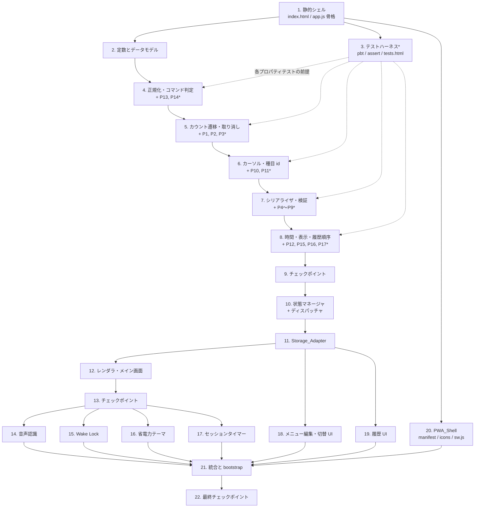

# Implementation Plan: voice-shot-counter-pwa

## Overview

ビルド工程・パッケージマネージャ・外部オリジン依存を一切持たない 7 個の静的ファイル（`index.html` / `app.js` / `manifest.json` / `sw.js` / `icon-192.png` / `icon-512.png` / `apple-touch-icon-180.png`）として実装する。ワークスペースは空であり、既存コードへの追従は不要である。

実装順序は設計の「純粋関数コアと副作用シェルの分離」に従う。

1. **静的シェル**: `index.html`（DOM + インライン CSS）と `app.js` の IIFE 骨格。依存解決もスキャフォールドも存在しないため、これが最初のタスクになる。
2. **純粋関数コア**: 正規化 / コマンド判定 / カウント遷移 / カーソル遷移 / シリアライズ / 検証 / 経過時間 / 表示算出。17 個の Correctness Property はすべてこの層のみを対象とするため、これを先に完成させる。
3. **プロパティテストハーネス**: `test/pbt.js` / `test/assert.js` / `test/tests.html`。各プロパティを「検証対象の関数が出来た直後」に書けるよう、純粋関数タスク群の直前に置く（設計の順序記述より前倒しするのは、17 個のプロパティを末尾にまとめず実装と隣接させるため）。
4. **副作用シェル**: 状態マネージャ → Storage_Adapter → レンダラ → 音声認識 → Wake Lock → テーマ → タイマー → メニュー編集 UI → 履歴 UI → PWA_Shell。Storage_Adapter は永続化を行う最初のサブシステム（テーマ・メニュー・履歴）より前に完成させる。メニュー編集（要件 17）と複数メニュー切替（要件 18）は Menu_Record の直列化と検証に依存するため、シリアライザ完成後に配置する。

`test/` 配下は成果物 7 ファイルに含めず、`sw.js` の `PRECACHE` にも列挙しない。

## Tasks

- [x] 1. 静的シェルと app.js の骨格
  - [x] 1.1 index.html を作成し、全パネルの DOM 構造とインライン CSS を同梱する
    - メイン画面、履歴画面、メニュー編集画面を単一 DOM 内のパネルとして配置（ページ遷移を行わない）
    - アクティブ種目の 6 項目、メニュー名、全体進捗テキスト、全体進捗バー、種目一覧、5 個の操作ボタン、全カウント初期化ボタン、フィードバック領域、各トグル、確認ダイアログの要素を定義
    - CSS はすべて `<style>` 要素として同梱し、外部オリジンのスタイルシート（CDN 配信の Tailwind CSS を含む）を参照しない
    - `app.js` を `type` 属性なしの `<script src="./app.js">` で読み込む
    - _Requirements: 16.1, 16.2, 16.3, 16.4, 8.1, 8.9, 7.1, 7.8, 8.13_

  - [x] 1.2 app.js に IIFE 骨格とサブシステムの配置枠を作成する
    - `(function () { 'use strict'; ... })();` で全体を包み、`import` / `export` を含めない
    - 定数領域、純粋関数領域、副作用レイヤ領域、`bootstrap()` の呼び出し枠を用意
    - `window.__VSC_TEST__` を純粋関数参照のみを載せる単一フックとして宣言（中身は後続タスクで充填）
    - _Requirements: 16.2, 16.4_

- [x] 2. 定数とデータモデルの定義
  - [x] 2.1 DRILL_MENU / COMMAND_TABLE / EXCLUSION_WORDS / LIMITS / THEME と既定メニュー生成を実装する
    - `DRILL_MENU` を 13 種目・id 1〜13（重複と欠番なし、配列順 = id 昇順）・セクション別合計 20 / 40 / 30 / 35・総計 125 の読み取り専用配列として定義
    - `COMMAND_TABLE` に 5 種別のコマンド語、`EXCLUSION_WORDS` に除外語（「ライン」「インサイド」「インステップ」「サイン」「アウトサイド」「前半」「手前」を含む最大 32 語）を定義
    - `LIMITS`（Make / Attempt 上限 999、操作履歴 20、種目数 1〜50、targetMake 1〜99、目標合計 1〜9999、メニュー数 1〜20、メニュー名 1〜30、履歴 100、経過時間 86399、正規化長 200）を定義
    - `THEME` に通常 / 省電力の配色トークンを定義
    - 既定メニュー（id `m-default`、名称「朝練125本IN」、`DRILL_MENU` の複製）を生成する関数と `nextDrillId(menu)` を実装
    - リテラル 125 を目標合計の算出経路に埋め込まない
    - _Requirements: 1.1, 1.2, 1.3, 1.4, 1.5, 1.6, 3.1, 3.2, 3.3, 3.4, 3.5, 3.10, 4.3, 5.1, 18.5_

  - [x]* 2.2 既定メニュー内容とテーマ配色定数の単体テストを書く（任意）
    - `test/spec-unit.js` に、13 種目・id 重複欠番なし・配列順 = id 昇順・セクション別合計・総計 125・メニュー名を全列挙で検証
    - 通常 / 省電力の両テーマについて規定された前景・背景の全ペアのコントラスト比を算出し、4.5:1 / 7:1 / 3:1 の各基準を検証
    - _Requirements: 1.3, 1.4, 1.5, 1.6, 18.5, 8.12, 10.6, 7.2_

- [x] 3. プロパティテストハーネス
  - [x]* 3.1 test/pbt.js に生成器・縮小器・実行器を実装する（任意）
    - `forAll(name, gens, prop, opts)`、`gen.int / oneOf / frequency / array / string / record / bind`
    - `mulberry32` による固定シード乱数とシード表示、整数 / 配列 / 文字列 / レコードの縮小（上限 200 ステップ、縮小前後の反例を両方報告）
    - _Requirements: 16.4_

  - [x]* 3.2 test/assert.js に deepEqual / ok / throwsNot を実装する（任意）
    - _Requirements: 16.4_

  - [x]* 3.3 test/tests.html にテストランナー入口を作成する（任意）
    - `../app.js` と `test/` 配下のスクリプトをすべて `type` 属性なしのクラシックスクリプトとして読み込む
    - 成功 / 失敗件数、失敗時の最小反例と乱数シードを DOM に出力する
    - _Requirements: 16.2, 16.4_

- [x] 4. 純粋関数: テキスト正規化とコマンド判定
  - [x] 4.1 normalizeText / buildExclusionMask / selectCommand / restartDelay を実装する
    - `normalizeText`: 半角カナ→全角カナ、全角英数→半角、英字→小文字、カタカナ→ひらがな、空白除去、区切り記号除去、先頭 200 文字への切り詰め
    - `buildExclusionMask`: 除外語の出現範囲を真偽配列でマスク
    - `selectCommand`: マスク後の出現のうち「開始位置最小 → 文字数最大 → 成功 / 失敗 / 次種目 / 前種目 / 取り消しの既定優先順」で 1 個を決定、該当なしは `null`
    - `restartDelay`: 結果受信ありは 300ms、結果なし連続時は倍々（上限 5000ms）
    - コマンド語側にも同一の正規化を適用した値で照合する
    - _Requirements: 3.1, 3.2, 3.3, 3.4, 3.5, 3.6, 3.8, 3.9, 3.10, 2.6_

  - [x]* 4.2 Property 14 のプロパティテストを書く（任意）
    - **Property 14: 正規化の冪等性**
    - `test/spec-command.js`。混合 Unicode 入力で `normalizeText(normalizeText(t)) === normalizeText(t)`、長さ 200 以下、除去対象文字の非残存
    - **Validates: Requirements 3.9**

  - [x]* 4.3 Property 13 のプロパティテストを書く（任意）
    - **Property 13: コマンド選択の決定性と優先順規則**
    - `test/spec-command.js`。素朴な参照実装（全出現列挙 →（index 昇順, length 降順, 種別優先順）安定ソート）とのモデルベース比較、マスク範囲の非選択、決定性
    - **Validates: Requirements 3.1, 3.2, 3.3, 3.4, 3.5, 3.6, 3.8, 3.10**

  - [x]* 4.4 語彙・除外語・再開待機・800ms 抑止の単体テストを書く（任意）
    - `test/spec-unit.js`。5 種別の全コマンド語を全列挙、除外語 7 語の単独テキストが `null`、`restartDelay` の 300ms / 倍々 / 5000ms 飽和 / 5 回目中止、同一種別 800ms 抑止の起点が直前の**発行**時刻から動かないこと
    - _Requirements: 3.1, 3.2, 3.3, 3.4, 3.5, 3.7, 3.10, 2.6, 2.11_

- [x] 5. 純粋関数: カウント遷移と取り消し
  - [x] 5.1 applyCount / undoCount / successRate / totals を実装する
    - `applyCount(counts, history, type, drillId)`: 成功は Make + 1 かつ Attempt + 1、失敗は Attempt + 1、他種目は不変。Attempt 999 で `{ok:false, reason:'CEILING'}` を返し履歴に追加しない
    - 操作履歴は `{drillId, type}` を実行順に最大 20 件、21 件目の追加時は最古 1 件を除去
    - `undoCount(counts, history)`: 最新 1 件のみを除去して対象種目を操作直前の値へ戻す。0 件なら `{ok:false, reason:'EMPTY_HISTORY'}`。Redo は提供しない
    - `successRate(make, attempt)`: `attempt === 0` は `null`、それ以外は `Math.round(make / attempt * 1000) / 10`
    - `totals(counts)`: 全体成功数と全体試投数
    - すべての戻り状態で `0 ≤ make ≤ attempt ≤ 999` を維持する
    - _Requirements: 4.1, 4.2, 4.3, 4.4, 4.5, 4.7, 4.8, 4.11, 4.13, 5.1, 5.2, 5.3, 5.4, 5.6, 5.9_

  - [x]* 5.2 Property 1 のプロパティテストを書く（任意）
    - **Property 1: Undo ラウンドトリップ**
    - `test/spec-count.js`。`attempt` を 995〜999 に寄せた分布を混合し、上限拒否時は状態が不変であること、他種目が不変であることを検証
    - **Validates: Requirements 5.10, 5.3, 4.13**

  - [x]* 5.3 Property 2 のプロパティテストを書く（任意）
    - **Property 2: 連続 Undo による初期状態への完全復帰**
    - `test/spec-count.js`。受理された操作数だけ取り消すと初期状態へ復帰し `history.length === 0`、次の取り消しは `EMPTY_HISTORY`
    - **Validates: Requirements 5.4, 5.5, 5.6**

  - [x]* 5.4 Property 3 のプロパティテストを書く（任意）
    - **Property 3: カウントの不変条件**
    - `test/spec-count.js`。長さ 0〜200 の MAKE / MISS / UNDO 混在列の各ステップ直後で全種目が `0 ≤ make ≤ attempt ≤ 999` を満たすこと（300 回反復）
    - **Validates: Requirements 4.3, 4.4**

- [x] 6. 純粋関数: カーソル遷移と種目 id 操作
  - [x] 6.1 cursorReducer / reindexAfterMenuChange / 種目編集の純粋版を実装する
    - `cursorReducer(index, N, command)`: `NEXT` / `PREV` / `SELECT(i)`。循環せず `AT_LAST` / `AT_FIRST` を返し、インデックスは常に `0 ≤ i ≤ N−1`、範囲外 `SELECT` は不変
    - `reorderDrills(menu, orderedIds)` / `removeDrill(menu, drillId)` / `addDrill(menu, draft)` と、カウント側の `purgeDrill` / `addDrill` の純粋版
    - 並べ替えと他種目削除の前後で既存種目の id を変えない（`nextDrillId` による払い出し）
    - `reindexAfterMenuChange(prevIndex, prevLength, newLength, removedIndex)`: 削除位置以降の先頭種目（末尾超過時は最終種目）を選ぶ
    - _Requirements: 6.1, 6.2, 6.3, 6.4, 6.5, 6.6, 6.7, 6.8, 17.2, 17.3, 17.12, 17.13, 17.14_

  - [x]* 6.2 Property 10 のプロパティテストを書く（任意）
    - **Property 10: カーソルの境界維持と非循環**
    - `test/spec-cursor.js`。N = 1 を高頻度に含め、長さ 0〜200 のコマンド列でカウント状態が不変であることも検証
    - **Validates: Requirements 6.5, 6.6, 6.7, 6.1**

  - [x]* 6.3 Property 11 のプロパティテストを書く（任意）
    - **Property 11: 種目 id の安定性**
    - `test/spec-cursor.js`。REORDER / REMOVE / ADD 混在列の後に残る id と対応する Make / Attempt が初期値と一致し、削除 id のカウントと操作履歴要素が残らないこと
    - **Validates: Requirements 17.2, 17.3, 17.12, 17.13**

  - [x]* 6.4 reindexAfterMenuChange の単体テストを書く（任意）
    - `test/spec-unit.js`。削除位置がアクティブより前 / 一致 / 後、末尾削除、種目 1 件の各ケース
    - _Requirements: 17.14_

- [x] 7. 純粋関数: シリアライザとメニュー検証
  - [x] 7.1 serializeSession / deserializeSession を実装する
    - 保存フィールドを `schemaVersion` / `startedAt` / `elapsedSec` / `menuId` / `activeIndex` / `counts` / `operations` / `ended` の 8 種類のみに限定し、キー順を固定した明示的組み立てで決定性を確保
    - `schemaVersion` の分岐: 欠落 / 非整数 / 現行値より大きい → 初期状態、現行値より小さい → 欠落フィールドを既定値で補完、現行値 → 値域検証
    - 値域検証違反（要素数不一致 / `make > attempt` / `attempt > 999` / `activeIndex` 範囲外 / `elapsedSec` 範囲外 / `operations` 21 件以上）で初期状態と `issues` を返す
    - 例外を送出せず、常に選択中メニューに整合する状態と `issues` を返す
    - メニュー id 集合を正とする reconcile（余剰 id のカウント破棄、欠落 id を 0 補完、該当 id の操作履歴要素除去）
    - _Requirements: 13.1, 13.2, 13.3, 13.4, 13.5, 13.6, 13.7, 13.8, 13.9, 13.10, 1.10, 6.10, 6.11_

  - [x] 7.2 serializeMenus / deserializeMenus / validateMenu を実装する
    - `Menu_Record` は `id` / `name` / `drills` の 3 フィールドのみ。`targetTotal` は保持せず `deriveTargetTotal` で算出
    - `validateMenu` の違反コード: メニュー数 1〜20、メニュー名 1〜30 文字かつ集合内一意、種目数 1〜50、種目 id のメニュー内一意、`name` 1〜40 文字、`section` 0〜20 文字、`targetMake` 1〜99 の整数、目標合計 1〜9999
    - 違反メニューを除外し、0 件になる場合は既定メニュー 1 件のみを返す
    - _Requirements: 13.11, 13.12, 13.13, 13.14, 17.4, 17.5, 17.7, 18.3, 18.4, 18.6_

  - [x]* 7.3 Property 4 のプロパティテストを書く（任意）
    - **Property 4: セッション直列化の決定性**
    - `test/spec-serializer.js`。キー挿入順をランダムに入れ替えたコピーとの出力一致も検証（配列要素順は入れ替えない）
    - **Validates: Requirements 13.4**

  - [x]* 7.4 Property 5 のプロパティテストを書く（任意）
    - **Property 5: セッション直列化のラウンドトリップ**
    - `test/spec-serializer.js`。メニューと Session_State を `gen.bind` で同時生成し、8 フィールドの深い等価と `issues` 0 件を検証
    - **Validates: Requirements 13.5, 13.3**

  - [x]* 7.5 Property 6 のプロパティテストを書く（任意）
    - **Property 6: 復元の冪等性**
    - `test/spec-serializer.js`。有効 / 欠落 / 値域違反 / 非 JSON / 空文字 / ランダム Unicode を各 1 割以上含む混合分布、500 回反復
    - **Validates: Requirements 13.6**

  - [x]* 7.6 Property 7 のプロパティテストを書く（任意）
    - **Property 7: 不正入力に対する復元の全域性**
    - `test/spec-serializer.js`。例外非送出、常に妥当な状態、各違反注入で初期状態 + `issues.length ≥ 1`、旧版は既存値保持（500 回反復）
    - **Validates: Requirements 13.7, 13.8, 13.9, 13.10**

  - [x]* 7.7 Property 8 のプロパティテストを書く（任意）
    - **Property 8: Menu_Record のラウンドトリップ**
    - `test/spec-serializer.js`。`section` に空文字と絵文字を含め、配列順を含む深い等価と直列化の決定性を検証
    - **Validates: Requirements 13.11, 13.12**

  - [x]* 7.8 Property 9 のプロパティテストを書く（任意）
    - **Property 9: メニュー検証条件の網羅と不正メニューの除外**
    - `test/spec-serializer.js`。違反を 1 種類ずつ注入（注入位置も生成対象）し、違反メニューの除外・他メニューの保持・0 件時の既定メニュー 1 件・違反コードの対応を検証
    - **Validates: Requirements 13.13, 13.14, 18.3, 18.6**

  - [x]* 7.9 schemaVersion 各分岐の単体テストを書く（任意）
    - `test/spec-unit.js`。欠落 / 非整数 / 0 / 1 / 2 の 5 ケースで採る分岐の一致
    - _Requirements: 13.8, 13.9, 13.10_

- [x] 8. 純粋関数: 経過時間・表示算出・履歴順序
  - [x] 8.1 elapsedFrom / formatElapsed / deriveTargetTotal / progressRatio / aggregateBySection / formatRate / sortHistoryIndex を実装する
    - `elapsedFrom(startedAtMs, pausedTotalMs, lastReportedSec, nowMs)`: 単調非減少、0〜86399 に飽和、時計の後退で直前値を下回らない
    - `formatElapsed(sec)`: 3600 未満は `mm:ss`、3600 以上は `h:mm:ss`
    - `deriveTargetTotal(menu)`: `targetMake` の総和（リテラル 125 を算出経路に持たない）
    - `progressRatio(totalMake, target)`: 0〜100 で上限打ち切り、小数第 1 位
    - `aggregateBySection(menu, counts)`: 同一 section を 1 行に集約し、Make 合計と targetMake 合計を保存
    - `formatRate(make, attempt)`: `attempt === 0` は `'--%'`、それ以外は `xx.x%`
    - `sortHistoryIndex(entries)`: `endedAt` 降順 → `id` 降順の全順序
    - _Requirements: 11.3, 11.8, 11.9, 8.4, 8.5, 8.10, 17.6, 4.5, 4.6, 4.7, 4.8, 14.2, 14.4, 14.6, 12.6_

  - [x]* 8.2 Property 12 のプロパティテストを書く（任意）
    - **Property 12: 経過時間の単調非減少と上限飽和**
    - `test/spec-timer.js`。増分に正 / 0 / 負 / 86400 秒超の巨大ジャンプを混在させ、`formatElapsed` の形式も検証
    - **Validates: Requirements 11.9, 11.3, 11.8**

  - [x]* 8.3 Property 15 のプロパティテストを書く（任意）
    - **Property 15: 目標合計の整合性と進捗充填率の値域**
    - `test/spec-display.js`。集約の保存則（行の Make 合計 = 全体成功数、targetMake 合計 = 目標合計）と目標超過時の厳密な 100 を検証
    - **Validates: Requirements 8.4, 8.5, 8.10, 4.7, 4.8, 17.6**

  - [x]* 8.4 Property 16 のプロパティテストを書く（任意）
    - **Property 16: 成功率の値域と丸めおよび未試投表示**
    - `test/spec-display.js`。`attempt = 0` / `make = attempt` / `make = 0` の境界を高頻度に含め、`formatRate` が `/^\d{1,3}\.\d%$/` に一致すること
    - **Validates: Requirements 4.5, 4.6, 14.4**

  - [x]* 8.5 Property 17 のプロパティテストを書く（任意）
    - **Property 17: 履歴並び順の全順序性**
    - `test/spec-display.js`。`endedAt` 重複を高頻度に含め、入力順の任意置換で結果の id 列が一致し、最古判定が末尾要素と一致すること
    - **Validates: Requirements 14.2, 14.6, 12.6**

- [x] 9. チェックポイント - 純粋関数コアの検証
  - 17 個のプロパティテストと単体テストを `tests.html` から実行し、すべて通ることを確認する。ask the user if questions arise.

- [x] 10. 状態マネージャとコマンドディスパッチャ
  - [x] 10.1 createCountManager を実装する
    - `initFromMenu` / `getCounts` / `apply` / `undo` / `resetAll` / `purgeDrill` / `addDrill` / `reconcile` / `getHistory` / `restore`
    - 内部遷移は 5.1 の純粋関数に委譲し、Make / Attempt を種目 id で選択中メニューに対応付ける
    - _Requirements: 1.7, 1.8, 1.10, 4.1, 4.2, 4.3, 4.4, 4.13, 5.1, 5.2, 5.3, 5.6, 5.7, 5.8, 7.10, 17.3, 17.12, 17.13_

  - [x] 10.2 createCursorManager を実装する
    - `setMenu` / `getIndex` / `getActiveDrill` / `next` / `prev` / `selectIndex` / `restore` / `reindexAfterMenuChange`
    - 新規セッションは先頭種目、復元値が範囲外なら先頭種目にしてカウントは保存値のまま維持
    - Make の targetMake 到達ではアクティブ種目を変えない
    - _Requirements: 6.1, 6.2, 6.3, 6.4, 6.5, 6.6, 6.7, 6.8, 6.9, 6.10, 6.11, 17.14_

  - [x] 10.3 createMenuManager のメモリ内コアを実装する
    - `listMenus` / `getActiveMenu` / `createMenu` / `duplicateMenu` / `renameMenu` / `deleteMenu` / `switchMenu` / `addDrill` / `updateDrill` / `removeDrill` / `reorderDrills` / `resetActiveMenuToDefault`
    - 戻り値は `{ok:true, menu} | {ok:false, violations}`。`validateMenu` に違反する編集は反映しない
    - メニュー数を常に 1 個以上に維持し、最後のメニュー削除を拒否。選択中メニュー削除時は残るメニューの 1 個を選択
    - _Requirements: 17.1, 17.2, 17.4, 17.5, 17.7, 17.8, 17.9, 17.16, 18.1, 18.2, 18.3, 18.4, 18.6, 18.7, 18.8_

  - [x] 10.4 Command_Dispatcher を実装する
    - `dispatch(command, source, timestampMs)` を音声・タッチ共通の単一入口とし、他タブ競合時は計数系コマンドを受け付けない
    - `source === 'touch'` の同一ボタン 300ms 以内の連打を破棄（音声側 800ms 抑止は二重適用しない）
    - 計数コマンドでタイマー未開始なら開始、拒否理由をメッセージ列に積み、変更領域に dirty フラグを立て、状態変化時に保存を 300ms デバウンスでスケジュール、全体成功数が目標合計に達したら達成時間の確定を要求
    - _Requirements: 7.4, 7.5, 7.7, 3.7, 4.13, 5.5, 6.5, 6.6, 11.2, 11.6, 12.4, 12.11_

  - [x]* 10.5 ディスパッチャの単体テストを書く（任意）
    - `test/spec-unit.js`。他タブ競合フラグ下で状態不変かつ拒否メッセージ、300ms 連打破棄、タッチと音声で結果状態と操作履歴が一致すること
    - _Requirements: 12.11, 7.7, 7.4_

- [x] 11. Storage_Adapter
  - [x] 11.1 guarded ラッパ・キーレイアウト・セッション / 設定 / 選択中メニュー識別子の関数を実装する
    - `guarded(key, fn)` で 1000ms タイムアウトを保証し、同期例外を送出せず `{code, key, message}` で拒否（`QUOTA_EXCEEDED` / `UNAVAILABLE` / `VERIFY_MISMATCH` / `NOT_FOUND` / `INVALID` / `TIMEOUT`）
    - `localStorage` の直接呼び出しをこのコンポーネント内部のみに閉じ、接頭辞 `vsc:` を持たない鍵を読まず・変更せず・削除しない
    - `vsc:probe` による書き込み→読込→削除の検証と、保存直後の読込値不一致の検知
    - `saveSession` / `loadSession` / `deleteSession` / `saveSettings` / `loadSettings` / `saveActiveMenuId` / `loadActiveMenuId`
    - _Requirements: 12.1, 12.2, 12.3, 12.7, 10.7, 18.12_

  - [x] 11.2 履歴関数と容量超過の退避ループを実装する
    - `appendHistory` / `listHistory` / `deleteHistory`。履歴は `vsc:hist:index` と `vsc:hist:{id}` の 1 件 1 鍵構成
    - 100 件超過時は「`endedAt` 最小 → id 最小」の 1 件を削除してから保存
    - 容量超過時は最古 1 件削除 → 再試行を、成功または履歴 0 件まで最大 100 回。履歴 0 件でも失敗する場合は内容を試行前のまま維持して `QUOTA_EXCEEDED` で拒否
    - _Requirements: 14.1, 14.5, 14.6, 14.7, 12.6, 12.9_

  - [x] 11.3 メニュー関数を実装する
    - `listMenus` / `saveMenu`（upsert）/ `deleteMenu`。直列化は 7.2 の関数に委譲
    - _Requirements: 12.1, 12.2, 17.17, 18.1, 18.3_

  - [x] 11.4 デバウンス保存・起動時復元・他タブ監視を配線する
    - Make / Attempt / アクティブ種目の変化を 300ms デバウンスで 1 回の保存にまとめ、1000ms 以内に完了
    - 起動時に進行中セッションを復元し、再開したことを示す表示を提示。履歴保存成功時に進行中セッションを削除
    - `storage` イベントで `vsc:session` の他タブ由来の変化を検知したら `conflictDetected` を立て、上書き保存を停止して再読込を促す
    - 失敗時は `reasonKey` により同一原因のメッセージを重複表示せず、メモリ内状態で操作を継続
    - _Requirements: 12.4, 12.5, 12.7, 12.8, 12.10, 12.11, 17.18_

  - [x]* 11.5 容量超過退避ループの単体テストを書く（任意）
    - `test/spec-unit.js`。`QuotaExceededError` を返す偽 storage を注入し、履歴 0 件 / 1 件 / 100 件で再試行回数と最終結果を検証
    - _Requirements: 12.6, 12.9_

  - [x]* 11.6 書き込み検証失敗とタイムアウトの単体テストを書く（任意）
    - `test/spec-unit.js`。`UNAVAILABLE` / `VERIFY_MISMATCH` / `TIMEOUT` の拒否値と短絡動作、メッセージ重複抑止
    - _Requirements: 12.2, 12.7_

- [x] 12. レンダラとメイン画面
  - [x] 12.1 レンダラ（dirty フラグ + requestAnimationFrame バッチ + 描画バジェット）を実装する
    - 領域単位（`active` / `progress` / `list` / `timer` / `feedback` / `status`）の dirty フラグでバッチ再描画し、状態を書き換えない
    - 省電力時は描画バジェット 200ms により毎秒 5 回以下へ制限し、200ms 以内の連続変化を 1 回に集約。アニメーション・トランジション・点滅・影の再描画を行わない
    - _Requirements: 8.6, 10.3, 10.4_

  - [x] 12.2 メイン画面の描画を実装する
    - アクティブ種目のセクション名 / 種目名 / 目標成功数 / Make / Attempt / 成功率の 6 項目、メニュー名、全体進捗テキスト `{全体成功数} / {目標合計}本 IN`、全体進捗バー、種目一覧の `{Make} / {targetMake}` 併記
    - アクティブ行と非アクティブ行の区別、目標達成済み種目の識別表示（targetMake 超過値もそのまま表示）、Attempt 0 の成功率は `--%`
    - 目標達成の提示を 500ms 以内、Make / Attempt 変化の反映を 200ms 以内
    - _Requirements: 8.1, 8.2, 8.3, 8.4, 8.5, 8.6, 8.7, 8.8, 8.12, 8.13, 4.6, 4.9, 4.12, 17.10_

  - [x] 12.3 表示領域に応じたレイアウト切替を実装する
    - 短辺 320 / 長辺 568 以上の縦向きで規定要素をスクロールなし表示し、種目一覧を縦スクロール領域とする
    - 長辺 568 未満では種目一覧を section 単位の集約表示（`aggregateBySection`）へ切り替える
    - 幅 > 高さのときも規定要素をスクロールなし表示する
    - `index.html` の CSS 側にレイアウト規則を追加する
    - _Requirements: 8.9, 8.10, 8.11_

  - [x] 12.4 5 個の操作ボタン・種目タップ・全カウント初期化を実装する
    - 「成功」「失敗」「次へ」「戻る」「取り消し」に文字ラベルと代替テキストを 1 個ずつ付与し、タップ領域 72px 以上・間隔 8px 以上
    - タップは音声と同一のディスパッチャ経路へ流し、100ms 以内に視覚的変化を提示。音声認識有効中も全ボタンを操作可能に維持し、タップで音声認識を停止しない。取り消しボタンは履歴件数に依らず常に操作可能
    - 全カウント初期化ボタンを独立領域（最近接ボタンから 24px 以上）に配置し、確認操作の完了まで状態を変えない。実行時は全 Make / Attempt を 0、操作履歴 0 件、アクティブ種目を先頭に設定
    - 種目一覧のタップでアクティブ種目を設定（カウントは不変、200ms 以内に反映）
    - _Requirements: 7.1, 7.2, 7.3, 7.4, 7.5, 7.6, 7.7, 7.8, 7.9, 7.10, 7.11, 6.8_

  - [x] 12.5 showMessage / showConfirm とフィードバック領域を実装する
    - `showMessage(kind, text, holdMs)` を利用者向け提示の単一経路とし、`info` / `warn` / `error` を省電力時もコントラスト比 7:1 を満たす無彩色系で表示
    - `reasonKey` による同一原因の重複抑止、カーソル両端メッセージの 3 秒継続、確定テキストと暫定テキストの視覚的区別（各 500ms 以内）
    - `showConfirm(spec)` を Promise ベースの確認表示として実装
    - _Requirements: 2.4, 2.9, 5.5, 6.5, 6.6, 10.6, 12.7_

  - [x]* 12.6 目標達成時の振動フィードバックを実装する（任意）
    - Vibration API があるとき、Make が targetMake に到達した 1 回のみ 200ms 振動し、超過後の加算では振動しない
    - _Requirements: 4.10_

  - [x]* 12.7 レイアウト切替境界の単体テストを書く（任意）
    - `test/spec-unit.js`。長辺 567 / 568 / 569 で集約表示と一覧表示が切り替わること
    - _Requirements: 8.10_

  - [x]* 12.8 test/spec-dom.js に DOM 層の検証を書く（任意・静的サーバー必須）
    - `tests.html` から `../index.html` を同一オリジンの `<iframe>` に読み込み、`getComputedStyle` と `getBoundingClientRect` で検証する
    - 描画内容（6 項目・メニュー名・`{Make} / {targetMake}` 併記・全体進捗形式）、代表 3 状態の DOM スナップショット、320×568 / 375×812 / 812×375 での文字高（短辺の 20〜30% / 5〜10% / 2.5〜5%）、ボタン寸法 72px と間隔 8px / 24px、規定要素がビューポート内に収まること、タッチと音声の結果一致、各ボタンのラベルと代替テキスト
    - `file://` では `iframe` の同一オリジン制約で動作しないため `python3 -m http.server` 等の簡易静的サーバー経由で開く。アプリ本体は `file://` でも動作する
    - _Requirements: 8.1, 8.2, 8.3, 8.4, 8.7, 8.9, 8.11, 8.13, 7.1, 7.3, 7.4, 7.8_

- [x] 13. チェックポイント - メイン画面での計測成立
  - タッチ操作のみでカウント・カーソル移動・取り消し・保存・復元が成立することを自動テストで確認し、すべてのテストが通ることを確認する。ask the user if questions arise.

- [x] 14. 音声認識
  - [x] 14.1 createSpeechRecognizer を実装する
    - `SpeechRecognition` / `webkitSpeechRecognition` のいずれかを用い、日本語・連続認識・暫定結果ありで 1 秒以内に開始。無効化後は自動再開しない
    - 確定結果のみ `selectCommand` でコマンド判定し、暫定結果は表示のみ。同一種別 800ms 以内の再判定を破棄し、抑止起点を直前の発行時刻から動かさない
    - `onend` 後の再開待機を `restartDelay` で決定し、空結果 5 回連続で中止してトグルを無効へ戻す
    - 非対応・マイク拒否・`network` エラー / オフラインの各分岐でメッセージを出し、自動再開を行わない
    - _Requirements: 2.1, 2.2, 2.3, 2.6, 2.7, 2.8, 2.10, 2.11, 3.7, 3.11, 15.7_

  - [x] 14.2 音声認識トグル・状態インジケーター・フィードバック表示を配線する
    - トグル初期状態を無効とし、「認識中」「再開待機中」「停止中」を視覚的に提示。確定 / 暫定テキストを 500ms 以内に反映
    - 非対応時はトグルを操作不可にし、手動ボタンで計測できることを提示
    - _Requirements: 2.1, 2.4, 2.5, 2.7, 2.8, 2.9, 2.11, 18.15, 7.11_

  - [x]* 14.3 自動再開バックオフと中止の単体テストを書く（任意）
    - `test/spec-unit.js`。偽の認識オブジェクトを注入し、300ms / 倍々 / 5000ms 飽和 / 5 回目中止、再有効化でカウンタが 0 に戻ること
    - _Requirements: 2.6, 2.11_

- [x] 15. 画面スリープ防止
  - [x] 15.1 createWakeLockManager を実装する
    - 練習開始および音声認識の有効化で screen 種別の Wake Lock を要求し、取得成功 / 失敗に確定。取得中はインジケーターを 1 秒以内に提示
    - 音声認識の無効化では解放せず、セッション終了で 1 秒以内に解放
    - `visibilitychange` の可視復帰かつ未取得かつセッション進行中で 2 秒以内に再要求。要求失敗および意図しない解放では同一可視状態内で自動再要求しない
    - 非対応時は要求を発行せず、代替手段を使わずにメッセージを提示して計測機能を維持
    - _Requirements: 9.1, 9.2, 9.3, 9.4, 9.5, 9.6, 9.7, 9.8, 9.9_

  - [x]* 15.2 Wake Lock 状態遷移の単体テストを書く（任意）
    - `test/spec-unit.js`。偽 `navigator.wakeLock` を注入し、取得成功 / 要求失敗 / 意図しない解放 / 可視復帰再要求の遷移を検証
    - _Requirements: 9.1, 9.6, 9.8_

- [x] 16. 省電力ダークモード
  - [x] 16.1 createThemeManager を実装する
    - `init` の優先順位を「保存値 > OS 配色 > 既定（無効）」とし、最初の画面描画時点で適用済みにする
    - `toggle` で 300ms 以内に配色を切り替え、500ms 以内に設定値を保存。`getRenderBudgetMs()` を通常 0 / 省電力 200 として返す
    - 省電力時も要件 8 の文字高・表示項目・要素配置を維持する
    - _Requirements: 10.1, 10.2, 10.5, 10.7, 10.8, 10.9, 10.10_

  - [x] 16.2 省電力配色トークンを index.html の CSS に実装する
    - 省電力時の背景 `#000000` と無彩色系前景、全表示項目のコントラスト比 7:1 以上、操作ボタンのラベル / 背景で 4.5:1 以上、アクティブ行 / 非アクティブ行で 3:1 以上、トグルのタップ領域 72px 以上
    - _Requirements: 10.1, 10.2, 10.6, 8.12, 7.2_

- [x] 17. 練習時間の計測
  - [x] 17.1 createSessionTimer を実装する
    - `start` / `ensureStarted` / `pause` / `resume` / `freeze` / `elapsedSec` / `snapshot` / `restore`。算出は 8.1 の `elapsedFrom` に委譲
    - 全体成功数が目標合計に達した時点または練習終了操作で達成時間を確定し、以後は再開せず増加させない
    - 非可視復帰および復元時は保存済み開始時刻・現在時刻・一時停止累計から算出して 1 秒以内に表示を更新
    - _Requirements: 11.1, 11.2, 11.4, 11.5, 11.6, 11.7, 11.8, 11.9_

  - [x] 17.2 練習開始 / 一時停止 / 再開 / 終了と経過時間表示を配線する
    - 開始操作で Wake Lock を要求し、終了操作で解放。経過時間を 1 秒周期で `mm:ss` / `h:mm:ss` 形式に更新し、一時停止中であることを 500ms 以内に提示
    - _Requirements: 11.1, 11.3, 11.4, 11.5, 11.7, 9.1, 9.7_

  - [x]* 17.3 タイマー復元と達成時間確定の単体テストを書く（任意）
    - `test/spec-unit.js`。`freeze` 後の非再開、復元時の算出、一時停止累計の反映
    - _Requirements: 11.6, 11.7, 11.8_

- [x] 18. メニュー編集と複数メニュー切替の UI
  - [x] 18.1 メニュー編集パネルを実装する
    - 種目の追加 / 削除 / 並べ替え / `name`・`section`・`targetMake` の編集。`section` は自由文字列（空欄可）として受け付ける
    - 検証違反は項目単位でメッセージを出し、編集前の値を維持。同一 section の種目を 1 セクションとして集約表示
    - 種目削除は対象種目名とカウント破棄を示す確認表示を経る。選択中メニューのリセットも確認表示を経て `DRILL_MENU` と同一内容に設定
    - _Requirements: 17.1, 17.2, 17.4, 17.5, 17.6, 17.7, 17.11, 17.15, 17.16_

  - [x] 18.2 セッション進行中の編集反映を配線する
    - `name` / `section` / `targetMake` の編集で全種目の Make / Attempt・アクティブ種目・操作履歴を維持し、targetMake を現 Make 未満に変更した場合は達成済み表示に切り替える
    - 種目削除の確定で当該 id の Make / Attempt と操作履歴要素を破棄し、追加種目は Make / Attempt 0。種目数変化時は `reindexAfterMenuChange` でアクティブ種目を再決定
    - 編集完了から 1000ms 以内に保存し、保存失敗時はメモリ内内容を正として操作を継続
    - _Requirements: 17.3, 17.8, 17.9, 17.10, 17.12, 17.13, 17.14, 17.17, 17.18_

  - [x] 18.3 メニュー一覧・作成・複製・名称変更・削除・切り替えの UI を実装する
    - 一覧の各行にメニュー名 / 種目数 / 目標合計を併記し、選択中行をコントラスト比 3:1 以上で区別
    - 制約違反（メニュー数 20 超 / 名称長 / 名称重複）は保存せずメッセージを提示。最後のメニュー削除は拒否
    - セッション進行中の切替は確認表示を経て、全体試投数 1 以上なら履歴を保存してから、0 なら保存せずに新セッション（Make / Attempt 0、先頭種目、操作履歴 0 件、経過時間 0 秒）を開始し、選択中メニュー識別子を 1000ms 以内に保存
    - _Requirements: 18.1, 18.2, 18.3, 18.4, 18.6, 18.7, 18.8, 18.9, 18.10, 18.11, 18.12, 18.16_

  - [x]* 18.4 メニュー切替時の分岐の単体テストを書く（任意）
    - `test/spec-unit.js`。全体試投数 0 / 1 以上での履歴保存有無、切替後の初期化内容、最後のメニュー削除拒否
    - _Requirements: 18.7, 18.9, 18.10, 18.11_

- [x] 19. 練習履歴の保存と閲覧
  - [x] 19.1 createHistoryView を実装する
    - 一覧を `sortHistoryIndex` の順で表示し、各行に終了日時（`YYYY-MM-DD HH:MM`）・メニュー名・達成時間・`{全体成功数} / {目標合計}`・全体成功率・達成状態を表示
    - レコード選択で全種目の `name` / `targetMake` / Make / Attempt / 成功率を 500ms 以内に表示（Attempt 0 は `--%`）
    - 削除は確認操作を経て対象 1 件のみ削除。0 件時は履歴なしのメッセージと 0 行
    - _Requirements: 14.2, 14.3, 14.4, 14.7, 14.8_

  - [x] 19.2 セッション終了時の履歴レコード生成と画面遷移を配線する
    - 終了時に一意な識別子・ISO 8601 拡張形式の終了日時・達成時間・メニュー識別子 / 名称・目標合計・全体成功数 / 試投数 / 成功率・達成状態・全種目スナップショットを保存し、成功時に進行中セッションを削除
    - 全体試投数 0 なら保存せず件数を維持してメッセージを提示
    - 履歴画面とメイン画面の往復で進行中セッションの計測を継続する
    - _Requirements: 14.1, 14.9, 14.10, 14.11, 12.10_

  - [x]* 19.3 履歴の表示と保存分岐の単体テストを書く（任意）
    - `test/spec-unit.js`。行の書式、詳細の `--%`、試投 0 での非保存、100 件超過時の最古削除
    - _Requirements: 14.3, 14.4, 14.6, 14.9_

- [x] 20. PWA_Shell
  - [x] 20.1 manifest.json を作成する
    - `name` / `short_name` / `start_url` / `scope` / `display: standalone` / `orientation: portrait` / `background_color` / `theme_color` と 192×192・512×512 のアイコンを相対パスで指定
    - _Requirements: 15.1, 16.1_

  - [x] 20.2 アイコン画像 3 個を実ファイルとして生成する
    - `icon-192.png`（192×192）、`icon-512.png`（512×512）、`apple-touch-icon-180.png`（180×180）を**実際の PNG バイナリとして生成**する（プレースホルダのテキストファイルや SVG では manifest の検証とホーム画面追加が成立しない）
    - 3 個はいずれも成果物 7 ファイルに含まれ、index.html と同一オリジンの相対パスで参照する
    - _Requirements: 15.1, 15.2, 16.1_

  - [x] 20.3 sw.js を作成する
    - `CACHE_NAME = 'vsc-cache-v1'`、`PRECACHE = ['./', './index.html', './app.js', './manifest.json', './icon-192.png', './icon-512.png', './apple-touch-icon-180.png']`
    - install は全 `PRECACHE` 資産の格納完了時のみ完了、activate は `CACHE_NAME` 以外のキャッシュを全件削除
    - fetch はナビゲーションを network-first（3 秒タイムアウト）→ キャッシュ済み `index.html`、同一オリジンのその他を cache-first（取得時にキャッシュへ格納）、他オリジンは介入しない
    - `import` / `export` を含めない。**`test/` 配下のファイルは `PRECACHE` に列挙せず、成果物 7 ファイルにも含めない**
    - _Requirements: 15.4, 15.6, 15.8, 15.9, 16.1, 16.2_

  - [x] 20.4 registerServiceWorker と非対応 / file:// 分岐を実装する
    - 同一オリジンのアプリ配置場所に限定したスコープで `sw.js` を登録し、`'registered'` / `'unsupported'` / `'file-scheme'` / `'failed'` のいずれかに確定
    - 非対応・`file://`・登録失敗ではメッセージを提示して Service Worker なしで動作を継続し、計測機能を操作可能に維持
    - 起動時および練習中に自オリジン以外へのネットワーク要求を発行しない
    - _Requirements: 15.3, 15.10, 16.5, 16.6_

  - [x] 20.5 index.html に manifest リンクと iOS メタ情報を追加する
    - `<link rel="manifest" href="./manifest.json">`、`apple-mobile-web-app-capable`、`apple-mobile-web-app-status-bar-style`、`<link rel="apple-touch-icon" href="./apple-touch-icon-180.png">`
    - _Requirements: 15.1, 15.2, 16.1_

- [x] 21. 統合と最終配線
  - [x] 21.1 bootstrap() の起動順序を実装し、テスト公開フックを確定する
    - 起動順序: テーマ適用（最初の描画前）→ メニュー集合と選択中メニューの復元 → 進行中セッションの復元と reconcile → 初回描画 → Service Worker 登録
    - 選択中メニュー識別子が一致しない場合は既定メニュー、なければ残存メニューの 1 個を選択してメッセージを提示し、決定した識別子を保存
    - `window.__VSC_TEST__` の公開対象を設計の一覧（`normalizeText` / `buildExclusionMask` / `selectCommand` / `applyCount` / `undoCount` / `successRate` / `totals` / `cursorReducer` / `reindexAfterMenuChange` / `serializeSession` / `deserializeSession` / `serializeMenus` / `deserializeMenus` / `validateMenu` / `nextDrillId` / `elapsedFrom` / `formatElapsed` / `formatRate` / `deriveTargetTotal` / `progressRatio` / `aggregateBySection` / `sortHistoryIndex` / `restartDelay` と読み取り専用定数）に限定し、ファクトリ関数・DOM 参照・localStorage ラッパを公開しない
    - _Requirements: 10.8, 12.5, 15.3, 18.13, 18.14, 1.10, 6.10, 6.11_

  - [x]* 21.2 tests.html に全 spec を登録して一括実行する（任意）
    - `spec-count` / `spec-serializer` / `spec-cursor` / `spec-timer` / `spec-command` / `spec-display` / `spec-unit` / `spec-dom` を登録し、17 プロパティと全単体テストの結果を集計表示する
    - 反復回数は Property 3・13 を 300 回、Property 6・7 を 500 回、その他を 100 回以上とする
    - _Requirements: 16.4_

- [x] 22. 最終チェックポイント
  - 全プロパティテスト・単体テストが通ること、成果物が 7 個の静的ファイルのみで動作すること、`test/` が `PRECACHE` と成果物に含まれないことを確認する。ask the user if questions arise.

## Notes

- `*` 付きのサブタスクは任意であり、動作するアプリの完成には不要である。内訳は次のとおり。
  - プロパティテストハーネス（3.1〜3.3）と 17 個のプロパティテスト、各単体テスト。任意テストを 1 つでも実施する場合は 3.1〜3.3 が前提になる。
  - `test/spec-dom.js`（12.8）は `iframe` の同一オリジン制約により簡易静的サーバー（`python3 -m http.server` 等）が必要で、`file://` では実行できない。
  - 振動フィードバック（12.6）は Vibration API 依存の補助的な提示であり、視覚的な達成表示（12.2）で要件 4-9 は満たされる。
- 17 個の Correctness Property はすべて `window.__VSC_TEST__` 経由の純粋関数のみを対象とし、DOM もブラウザ API のモックも必要としない。各プロパティテストは検証対象の関数を実装した直後のタスクに隣接させている。
- 実装のほぼ全体が単一の `app.js` に集まるため、依存グラフの各ウェーブに含まれる `app.js` タスクは 1 個のみである。並行実行できるのは主にテストファイル・`manifest.json` / `sw.js` / アイコン / `index.html` を対象とするタスクである。
- 設計の「実機手動確認が必須な項目」「オフライン・キャッシュ更新の確認手順」は端末実機とブラウザ DevTools を要するため、本タスクリストの対象外である。
- 目標合計は常に選択中メニューの `targetMake` 総和として算出し、リテラル 125 を算出経路に持たない。125 / 13 種目 / 20・40・30・35 は既定メニューの初期内容としてのみ扱う。

## Task Dependency Graph



```json
{
  "waves": [
    { "id": 0, "tasks": ["1.1", "1.2", "3.1", "3.2", "20.1", "20.2"] },
    { "id": 1, "tasks": ["2.1", "3.3", "20.3"] },
    { "id": 2, "tasks": ["4.1", "2.2"] },
    { "id": 3, "tasks": ["5.1", "4.2", "4.4"] },
    { "id": 4, "tasks": ["6.1", "4.3", "5.2"] },
    { "id": 5, "tasks": ["7.1", "5.3", "6.2", "6.4"] },
    { "id": 6, "tasks": ["7.2", "5.4", "6.3"] },
    { "id": 7, "tasks": ["8.1", "7.3", "7.9"] },
    { "id": 8, "tasks": ["10.1", "7.4", "8.2", "8.3"] },
    { "id": 9, "tasks": ["10.2", "7.5", "8.4"] },
    { "id": 10, "tasks": ["10.3", "7.6", "8.5"] },
    { "id": 11, "tasks": ["10.4", "7.7"] },
    { "id": 12, "tasks": ["11.1", "7.8", "10.5"] },
    { "id": 13, "tasks": ["11.2"] },
    { "id": 14, "tasks": ["11.3"] },
    { "id": 15, "tasks": ["11.4"] },
    { "id": 16, "tasks": ["12.1", "11.5"] },
    { "id": 17, "tasks": ["12.2", "11.6"] },
    { "id": 18, "tasks": ["12.3"] },
    { "id": 19, "tasks": ["12.4", "12.7"] },
    { "id": 20, "tasks": ["12.5"] },
    { "id": 21, "tasks": ["12.6"] },
    { "id": 22, "tasks": ["14.1"] },
    { "id": 23, "tasks": ["14.2"] },
    { "id": 24, "tasks": ["15.1", "14.3"] },
    { "id": 25, "tasks": ["16.1", "16.2", "15.2"] },
    { "id": 26, "tasks": ["17.1"] },
    { "id": 27, "tasks": ["17.2"] },
    { "id": 28, "tasks": ["18.1", "17.3"] },
    { "id": 29, "tasks": ["18.2"] },
    { "id": 30, "tasks": ["18.3"] },
    { "id": 31, "tasks": ["19.1", "18.4"] },
    { "id": 32, "tasks": ["19.2"] },
    { "id": 33, "tasks": ["20.4", "20.5", "19.3"] },
    { "id": 34, "tasks": ["21.1", "12.8"] },
    { "id": 35, "tasks": ["21.2"] }
  ]
}
```
